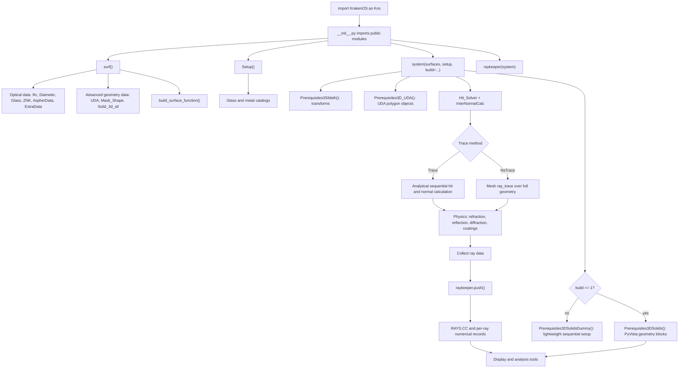
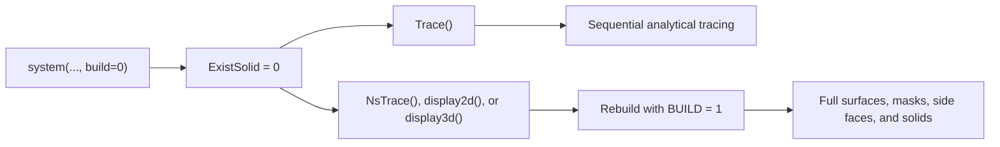
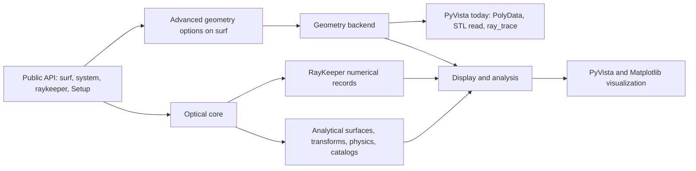

# KrakenOS Architecture Notes

This document records the current internal architecture and the conservative
direction for reducing unnecessary PyVista coupling. It is a maintenance guide,
not a replacement for the user manual.

## Public API Principle

KrakenOS should keep the public workflow stable:

```python
import KrakenOS as Kos

surface = Kos.surf()
setup = Kos.Setup()
system = Kos.system([surface], setup)
rays = Kos.raykeeper(system)
system.Trace([0, 0, 0], [0, 0, 1], 0.55)
rays.push()
```

The internal architecture may become cleaner, but users should not need to
choose a different surface class just because a surface later uses an STL solid,
a UDA polygon, or a geometric mask.

## Current Flow



## Build Modes

`Kos.system(..., build=0)` and `Kos.system(..., build=1)` already provide the
main architectural switch.

| Mode | Current role | Geometry at construction | Intended use |
| --- | --- | --- | --- |
| `build=0` | Lightweight sequential setup | No full PyVista surface or side mesh blocks | Fast sequential tracing, optimization loops, calculations that do not need mesh geometry |
| `build=1` | Full geometry setup | Builds PyVista-backed surface, mask, side, and solid blocks | 3D display, STL objects, masks, UDA meshes, and non-sequential tracing |

When a lightweight system later needs full geometry, KrakenOS rebuilds it on
demand. This preserves side-face behavior for non-sequential tracing:



The regression test `tests/test_build_modes.py` protects this behavior. A
system with glass starts without side meshes in `build=0`, then `NsTrace()`
rebuilds full geometry and restores side-face blocks.

## PyVista Responsibilities

PyVista currently has two different responsibilities in KrakenOS. Keeping those
roles explicit helps decide what to refactor.

| Area | Current PyVista role | Refactor direction |
| --- | --- | --- |
| `Display.py` | Visualization backend for 3D surfaces and rays | Keep PyVista justified here; adapt it to consume KrakenOS data |
| `GeometryBackend.py` | Small internal adapter around PyVista mesh creation and loading | Centralize PyVista calls before any future backend replacement |
| `Prerequisites3D.py` | Geometry preparation for meshes, masks, side faces, STL files, and ray-mesh intersections | Use the backend adapter for mesh creation/loading and keep optical geometry behavior unchanged |
| `InterNormalCalc.py` / `KrakenSys.py` | Indirectly use PyVista mesh `ray_trace()` for non-sequential geometry | Preserve behavior until KrakenOS has its own robust triangle mesh backend |
| `RayKeeper.py` | Previously held unused PyVista containers | Removed; raykeeper now stores numerical ray data |
| `UDA.py` | Previously built PyVista mesh during UDA construction | Mesh is now lazy; polygon hit testing works without mesh construction |
| `Display.py` 2D rays | Previously converted ray points to PyVista lines | Removed; 2D rays plot directly from `RAYS.CC` |

## Current Layering



The important design decision is that `surf()` remains the single public
surface object. Advanced features such as `UDA`, `Mask_Shape`, and
`Solid_3d_stl` stay available on that object, while KrakenOS decides internally
when full geometry is needed.

## Conservative Refactor Rules

1. Preserve numerical and physical behavior.
2. Preserve public examples and the normal `import KrakenOS as Kos` style.
3. Keep PyVista for display, STL, masks, side faces, and non-sequential
   ray-mesh intersections until replacement geometry is tested.
4. Remove PyVista only where it is acting as an unnecessary container or
   conversion step.
5. Add a regression test before changing behavior that protects side faces,
   masks, UDA, STL, or non-sequential tracing.

## Completed Decoupling Steps

| Step | Result |
| --- | --- |
| `RayKeeper.py` | Removed direct PyVista dependency and kept numerical ray storage in `RAYS.CC`. |
| `MeshBlock.py` | Added a lightweight list-like container with `.n_blocks` compatibility. |
| Internal blocks | `AAA`, `BBB`, `DDD`, `EEE`, and mask collections can use `MeshBlock` where PyVista container behavior is unnecessary. |
| 3D display | Display now accepts block containers and plots their PyVista mesh contents. |
| 2D rays | `Plot2DRays()` draws directly from numerical arrays instead of `pv.lines_from_points()`. |
| Missing masks | Unmasked surfaces use an empty `MeshBlock` instead of a dummy PyVista disk. |
| UDA | Polygon hit testing is separated from lazy PyVista mesh construction. |
| `build=0` | Lightweight setup skips dummy side mesh construction; full geometry rebuild remains automatic for `NsTrace()` and displays. |
| Geometry backend | `GeometryBackend.py` centralizes PyVista calls for disc creation, `PolyData`, STL/mesh reading, and PolyData detection. |

## Candidate Future Steps

| Candidate | Expected risk | Notes |
| --- | --- | --- |
| Document `build=0` and `build=1` for users | Low | Useful once wording is stable. |
| Make `SurfClass.RestoreVTK()` import PyVista lazily | Low | Keeps legacy method while avoiding a global import from `SurfClass.py`. |
| Add an internal geometry adapter module | Medium | Would centralize PyVista calls without changing public API. |
| Separate 2D surface plotting from full PyVista meshes | Medium | Could make basic `display2d()` lighter. Needs careful visual comparison. |
| Replace `pv.Disc()` for simple analytical surface meshes | Medium-high | Requires a tested internal mesh representation. |
| Replace STL loading and `mesh.ray_trace()` | High | Requires robust triangle mesh intersection, normals, tolerances, and acceleration. |
