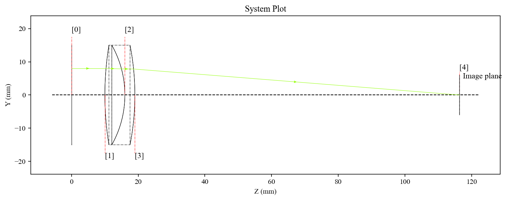
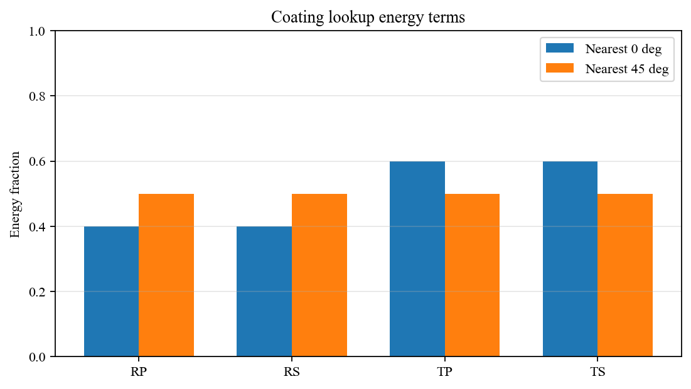
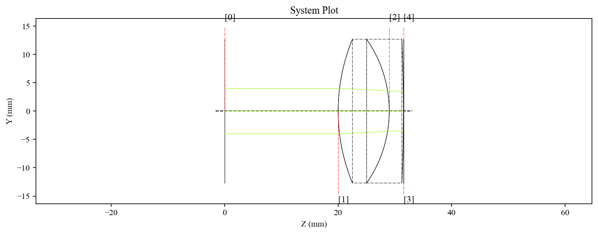
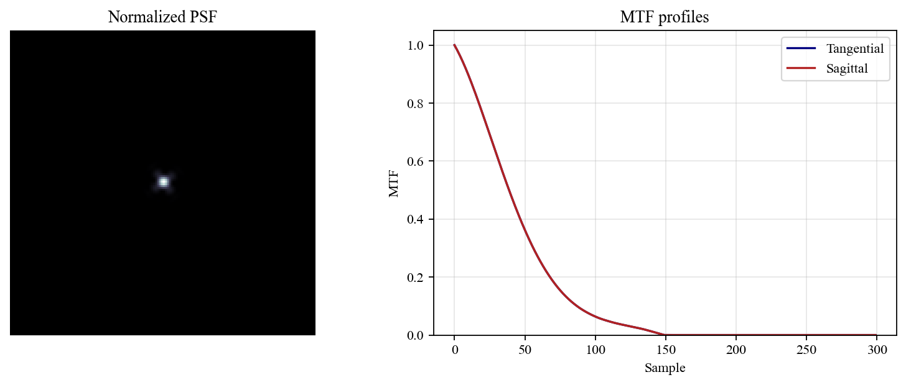
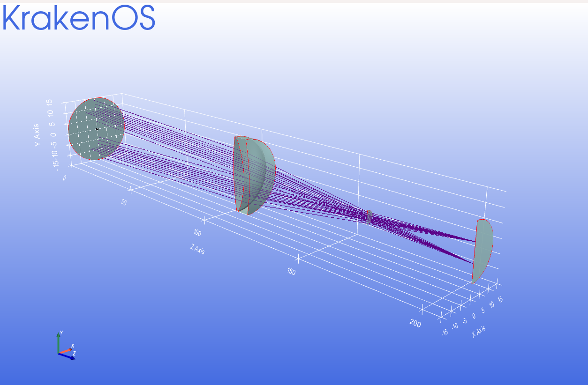
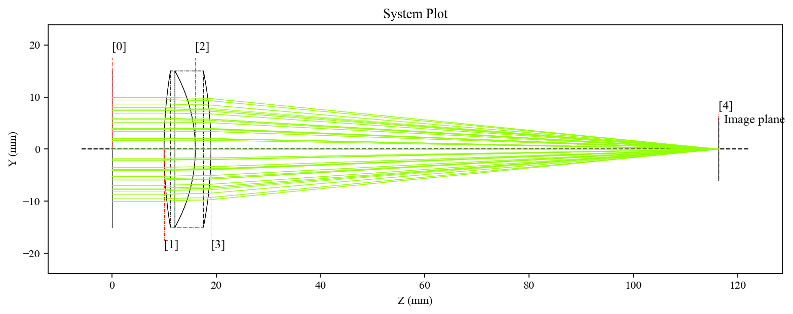
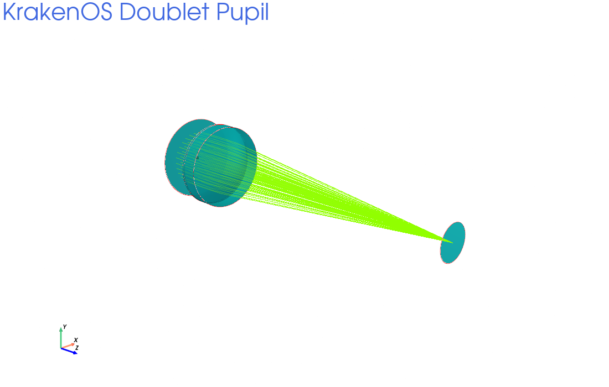

# KrakenOS Examples Manual

This manual is generated from the example scripts in `KrakenOS/Examples`.
Each section links back to the runnable Python file and summarizes the
didactic notes written in the example docstrings.

Generated with:

```bash
python tools/generate_examples_manual.py
```

Images are loaded from `docs/assets/examples/` when available. They can
be created with `python tools/generate_example_images.py --all` or added
manually with names such as `Examp_Ray_2d.png` and `Examp_Ray_3d.png`.

## Quick Index

- [Aberration analysis](#aberration-analysis)
- [Atmospheric refraction correction](#atmospheric-refraction-correction)
- [Basic ray tracing](#basic-ray-tracing)
- [Basic surface tracing](#basic-surface-tracing)
- [Catalog configuration](#catalog-configuration)
- [Coating and energy](#coating-and-energy)
- [Coating and non-sequential tracing](#coating-and-non-sequential-tracing)
- [Custom surface profile](#custom-surface-profile)
- [Custom surface shape](#custom-surface-shape)
- [Cylindrical optics](#cylindrical-optics)
- [Diffraction grating](#diffraction-grating)
- [External catalogs](#external-catalogs)
- [Idealized lens](#idealized-lens)
- [Idealized telescope](#idealized-telescope)
- [Lens catalogs](#lens-catalogs)
- [Lens design and focus](#lens-design-and-focus)
- [Material dispersion](#material-dispersion)
- [Metal coatings](#metal-coatings)
- [Mirror tracing](#mirror-tracing)
- [Non-sequential tracing](#non-sequential-tracing)
- [Obscuration and RMS analysis](#obscuration-and-rms-analysis)
- [Obscuration and spot diagrams](#obscuration-and-spot-diagrams)
- [Optical testing](#optical-testing)
- [Optimization](#optimization)
- [Optimization setup](#optimization-setup)
- [PSF and MTF](#psf-and-mtf)
- [Paraxial optics](#paraxial-optics)
- [Prism refraction](#prism-refraction)
- [Pupil tracing](#pupil-tracing)
- [Ray source sampling](#ray-source-sampling)
- [Reverse tracing](#reverse-tracing)
- [STL geometry](#stl-geometry)
- [Solid geometry](#solid-geometry)
- [Special surfaces](#special-surfaces)
- [Spectrograph geometry](#spectrograph-geometry)
- [Spot analysis](#spot-analysis)
- [System diagnostics](#system-diagnostics)
- [Telescope accessory optics](#telescope-accessory-optics)
- [Telescope and STL geometry](#telescope-and-stl-geometry)
- [Telescope and spectrograph model](#telescope-and-spectrograph-model)
- [Telescope model](#telescope-model)
- [Tilted components](#tilted-components)
- [User material model](#user-material-model)
- [Visualization](#visualization)
- [Wavefront analysis](#wavefront-analysis)
- [Wavefront optimization](#wavefront-optimization)

## Aberration analysis

| Example | Level | Summary | Required files |
| --- | --- | --- | --- |
| [`Examp_Doublet_Lens_Pupil_Seidel.py`](#examp-doublet-lens-pupil-seidel) | Advanced | Doublet pupil calculation with Seidel terms. | - |

### Examp_Doublet_Lens_Pupil_Seidel.py

- **Level:** Advanced
- **Topic:** Aberration analysis
- **Required files:** -
- **Source:** [`Examp_Doublet_Lens_Pupil_Seidel.py`](../KrakenOS/Examples/Examp_Doublet_Lens_Pupil_Seidel.py)

This example combines pupil setup, Seidel aberration calculations, and ray
tracing through a doublet lens.

**What You Learn**

- how to configure `PupilCalc` for Seidel analysis
- how to read spherical, coma, astigmatism, field curvature, and chromatic aberration outputs
- how changing Fraunhofer wavelengths affects chromatic aberration terms
- how to trace the pupil-generated rays after the aberration calculation

**Expected Output**

- printed Seidel and chromatic-aberration terms
- a 2D layout of the pupil-generated ray bundle

**Didactic Notes**

- the commented print blocks are intentionally left in the file. They are optional inspection snippets for users who want to explore individual Seidel table entries and sums.

**Units**

- distances are in millimeters
- wavelengths are in micrometers

**Run**

```bash
python KrakenOS/Examples/Examp_Doublet_Lens_Pupil_Seidel.py
```

<!-- Optional image placeholder:
Add docs/assets/examples/Examp_Doublet_Lens_Pupil_Seidel_2d.png
or docs/assets/examples/Examp_Doublet_Lens_Pupil_Seidel_3d.png
to show images here.
-->

## Atmospheric refraction correction

| Example | Level | Summary | Required files |
| --- | --- | --- | --- |
| [`Examp_Tel_2M_Atmospheric_Refraction_Corrector_Adaptable.py`](#examp-tel-2m-atmospheric-refraction-corrector-adaptable) | Advanced | 2 m telescope with adaptable atmospheric refraction corrector. | - |
| [`Examp_Tel_2M_Atmospheric_Refraction_Corrector_Static.py`](#examp-tel-2m-atmospheric-refraction-corrector-static) | Advanced | 2 m telescope with static atmospheric refraction corrector. | - |

### Examp_Tel_2M_Atmospheric_Refraction_Corrector_Adaptable.py

- **Level:** Advanced
- **Topic:** Atmospheric refraction correction
- **Required files:** -
- **Source:** [`Examp_Tel_2M_Atmospheric_Refraction_Corrector_Adaptable.py`](../KrakenOS/Examples/Examp_Tel_2M_Atmospheric_Refraction_Corrector_Adaptable.py)

This example models an atmospheric dispersion corrector whose prism rotation is
selected for different zenith distances, then traces three wavelengths through
the telescope/corrector system.

**What You Learn**

- how atmosphere-aware `PupilCalc` settings are reused across wavelengths
- how corrector rotation and zenith distance are paired in a design study
- how separate ray containers make wavelength comparison easier
- how a custom plotting helper overlays the resulting spots

**Expected Output**

- a color-coded spot diagram for three wavelengths

**Didactic Notes**

- four book-style cases are left in the file as consecutive assignments. The last active pair is used by default; comment/uncomment the cases to compare other corrector rotations and zenith distances.

**Units**

- distances are in millimeters
- wavelengths are in micrometers

**Run**

```bash
python KrakenOS/Examples/Examp_Tel_2M_Atmospheric_Refraction_Corrector_Adaptable.py
```

<!-- Optional image placeholder:
Add docs/assets/examples/Examp_Tel_2M_Atmospheric_Refraction_Corrector_Adaptable_2d.png
or docs/assets/examples/Examp_Tel_2M_Atmospheric_Refraction_Corrector_Adaptable_3d.png
to show images here.
-->

### Examp_Tel_2M_Atmospheric_Refraction_Corrector_Static.py

- **Level:** Advanced
- **Topic:** Atmospheric refraction correction
- **Required files:** -
- **Source:** [`Examp_Tel_2M_Atmospheric_Refraction_Corrector_Static.py`](../KrakenOS/Examples/Examp_Tel_2M_Atmospheric_Refraction_Corrector_Static.py)

This example places a fixed atmospheric refraction corrector in the 2 m
telescope optical path and traces three wavelengths using atmosphere-aware
pupil generation.

**What You Learn**

- how `PupilCalc` atmospheric-refraction parameters are configured
- how different wavelengths are traced with different atmospheric dispersion settings
- how a static corrector changes the chromatic spot diagram

**Expected Output**

- a 3D telescope/corrector layout
- a color-coded spot diagram for three wavelengths

**Didactic Notes**

- the `BestFocus` and RMS lines at the end are intentionally commented. They are optional checks for users who want to extend the example into a merit analysis.

**Units**

- distances are in millimeters
- wavelengths are in micrometers

**Run**

```bash
python KrakenOS/Examples/Examp_Tel_2M_Atmospheric_Refraction_Corrector_Static.py
```

<!-- Optional image placeholder:
Add docs/assets/examples/Examp_Tel_2M_Atmospheric_Refraction_Corrector_Static_2d.png
or docs/assets/examples/Examp_Tel_2M_Atmospheric_Refraction_Corrector_Static_3d.png
to show images here.
-->

## Basic ray tracing

| Example | Level | Summary | Required files |
| --- | --- | --- | --- |
| [`Examp_Ray.py`](#examp-ray) | Beginner | Single-ray trace through a simple doublet. | - |

### Examp_Ray.py

- **Level:** Beginner
- **Topic:** Basic ray tracing
- **Required files:** -
- **Source:** [`Examp_Ray.py`](../KrakenOS/Examples/Examp_Ray.py)

This is one of the smallest complete KrakenOS examples. It builds a sequential
doublet, traces a single off-axis ray, stores the result in a `raykeeper`, and
plots the ray path in 2D.

**What You Learn**

- the minimum sequence of `surf` objects needed to build an optical system
- how to define a ray source point and direction cosines
- how `system.Trace` and `raykeeper.push` work together

**Expected Output**

- a 2D layout showing the traced ray through the doublet

**Units**

- distances are in millimeters
- wavelengths are in micrometers

**Run**

```bash
python KrakenOS/Examples/Examp_Ray.py
```

**Example Images**



## Basic surface tracing

| Example | Level | Summary | Required files |
| --- | --- | --- | --- |
| [`Examp_Sphere.py`](#examp-sphere) | Beginner | Spherical mirror with metal coating data. | - |

### Examp_Sphere.py

- **Level:** Beginner
- **Topic:** Basic surface tracing
- **Required files:** -
- **Source:** [`Examp_Sphere.py`](../KrakenOS/Examples/Examp_Sphere.py)

Spherical surface example.

This example traces a small ray fan from a spherical mirror and prints the
computed reflection coefficients. It also demonstrates loading a metal coating
resource from the installed KrakenOS package.

**What You Learn**

- loading packaged metal data with `importlib.resources`
- assigning a mirror coating model
- using `PupilCalc` to trace a simple ray fan
- inspecting S and P polarization reflection outputs Units are the KrakenOS example defaults: distances in millimeters and wavelengths in micrometers unless the code states otherwise.

**Run**

```bash
python KrakenOS/Examples/Examp_Sphere.py
```

<!-- Optional image placeholder:
Add docs/assets/examples/Examp_Sphere_2d.png
or docs/assets/examples/Examp_Sphere_3d.png
to show images here.
-->

## Catalog configuration

| Example | Level | Summary | Required files |
| --- | --- | --- | --- |
| [`Examp_Glass_Catalog_Order.py`](#examp-glass-catalog-order) | Beginner | Glass catalog loading order. | - |

### Examp_Glass_Catalog_Order.py

- **Level:** Beginner
- **Topic:** Catalog configuration
- **Required files:** -
- **Source:** [`Examp_Glass_Catalog_Order.py`](../KrakenOS/Examples/Examp_Glass_Catalog_Order.py)

This example prints the deterministic glass catalog order used by KrakenOS and
shows what happens when a glass name appears in several loaded catalogs.

**What You Learn**

- how `Setup().GlassCat` stores the active catalog list
- why catalog priority matters when a glass name is duplicated
- how to inspect which catalogs contain a given glass name

**Expected Output**

- the first loaded catalogs
- all catalogs containing the selected glass name
- the first matching catalog that KrakenOS will use by priority

**Didactic Notes**

- this example only reports catalog order. It does not claim that the first matching catalog is always the best physical choice.

**Run**

```bash
python KrakenOS/Examples/Examp_Glass_Catalog_Order.py
```

<!-- Optional image placeholder:
Add docs/assets/examples/Examp_Glass_Catalog_Order_2d.png
or docs/assets/examples/Examp_Glass_Catalog_Order_3d.png
to show images here.
-->

## Coating and energy

| Example | Level | Summary | Required files |
| --- | --- | --- | --- |
| [`Examp_Coating_Energy_Basics.py`](#examp-coating-energy-basics) | Beginner | Basic coating table and energy terms. | - |

### Examp_Coating_Energy_Basics.py

- **Level:** Beginner
- **Topic:** Coating and energy
- **Required files:** -
- **Source:** [`Examp_Coating_Energy_Basics.py`](../KrakenOS/Examples/Examp_Coating_Energy_Basics.py)

This example builds a tiny air-to-air system with a coated flat surface. The
geometry is intentionally simple so the output can focus on the coating table
format and the reflected/transmitted energy terms stored by KrakenOS.

**What You Learn**

- how to define a coating table as `[R, A, W, THETA]`
- how KrakenOS chooses the nearest wavelength and angle sample
- where reflected and transmitted S/P energy terms are stored
- how total transmission is accumulated in `system.TT`

**Expected Output**

- coating lookup values for two incidence-angle samples
- traced ray energy terms for one coated surface

**Units**

- distances are in millimeters
- wavelengths are in micrometers
- coating angles are in degrees

**Run**

```bash
python KrakenOS/Examples/Examp_Coating_Energy_Basics.py
```

**Example Images**



## Coating and non-sequential tracing

| Example | Level | Summary | Required files |
| --- | --- | --- | --- |
| [`Examp_Flat_NonSec_AR-caoating.py`](#examp-flat-nonsec-ar-caoating) | Advanced | Historical flat coated non-sequential example. | - |

### Examp_Flat_NonSec_AR-caoating.py

- **Level:** Advanced
- **Topic:** Coating and non-sequential tracing
- **Required files:** -
- **Source:** [`Examp_Flat_NonSec_AR-caoating.py`](../KrakenOS/Examples/Examp_Flat_NonSec_AR-caoating.py)

Flat non-sequential coated surface.

This example uses non-sequential tracing with coating tables on a compact
doublet-like geometry. The file name keeps its historical spelling so existing
links do not break.

**What You Learn**

- assigning coating tables with `[R, A, W, THETA]`
- enabling probabilistic surface behavior with `energy_probability`
- tracing repeated non-sequential paths for a small ray fan Units are the KrakenOS example defaults: distances in millimeters and wavelengths in micrometers unless the code states otherwise.

**Run**

```bash
python KrakenOS/Examples/Examp_Flat_NonSec_AR-caoating.py
```

<!-- Optional image placeholder:
Add docs/assets/examples/Examp_Flat_NonSec_AR-caoating_2d.png
or docs/assets/examples/Examp_Flat_NonSec_AR-caoating_3d.png
to show images here.
-->

## Custom surface profile

| Example | Level | Summary | Required files |
| --- | --- | --- | --- |
| [`Examp_Fresnel.py`](#examp-fresnel) | Advanced | Fresnel lens from a sampled radial profile. | R1064_F1800.txt |

### Examp_Fresnel.py

- **Level:** Advanced
- **Topic:** Custom surface profile
- **Required files:** R1064_F1800.txt
- **Source:** [`Examp_Fresnel.py`](../KrakenOS/Examples/Examp_Fresnel.py)

This example loads a packaged radial profile file, converts it into a callable
surface function, and attaches it to a surface with `ExtraData`.

**What You Learn**

- how to load example data with `importlib.resources`
- how a sampled radial profile can be converted into a Fresnel-like surface
- why fine derivative precision can matter for structured optical elements
- how to compare 3D and 2D visualization of the traced rays Required packaged file:
- `KrakenOS/Examples/R1064_F1800.txt`

**Expected Output**

- a 3D view and a 2D view of rays through the Fresnel profile

**Units**

- distances are in millimeters
- wavelengths are in micrometers

**Run**

```bash
python KrakenOS/Examples/Examp_Fresnel.py
```

<!-- Optional image placeholder:
Add docs/assets/examples/Examp_Fresnel_2d.png
or docs/assets/examples/Examp_Fresnel_3d.png
to show images here.
-->

## Custom surface shape

| Example | Level | Summary | Required files |
| --- | --- | --- | --- |
| [`Examp_ExtraShape_Micro_Lens_Array.py`](#examp-extrashape-micro-lens-array) | Advanced | Micro-lens array extra shape. | - |
| [`Examp_ExtraShape_UserFacets.py`](#examp-extrashape-userfacets) | Advanced | Faceted user-defined surface. | - |
| [`Examp_ExtraShape_XY_Cosines_UDA.py`](#examp-extrashape-xy-cosines-uda) | Advanced | XY cosine surface with user-defined aperture. | - |
| [`Examp_ExtraShape_Radial_Sine.py`](#examp-extrashape-radial-sine) | Intermediate | Radial sine extra shape. | - |
| [`Examp_ExtraShape_XY_Cosines.py`](#examp-extrashape-xy-cosines) | Intermediate | XY cosine extra shape. | - |

### Examp_ExtraShape_Micro_Lens_Array.py

- **Level:** Advanced
- **Topic:** Custom surface shape
- **Required files:** -
- **Source:** [`Examp_ExtraShape_Micro_Lens_Array.py`](../KrakenOS/Examples/Examp_ExtraShape_Micro_Lens_Array.py)

This example approximates a micro-lens array by folding local coordinates into
repeated cells and evaluating a conic-like sag function in each cell.

**What You Learn**

- how a custom `ExtraData` function can describe repeated surface cells
- how the coefficient list controls pitch, curvature, and conic behavior
- how to keep a 3D display active while leaving 2D plotting optional

**Expected Output**

- a 3D view of rays interacting with the micro-lens array surface

**Didactic Notes**

- the 2D display call is intentionally commented. Uncomment it if you want a simpler projection after inspecting the 3D geometry.

**Units**

- distances are in millimeters
- wavelengths are in micrometers

**Run**

```bash
python KrakenOS/Examples/Examp_ExtraShape_Micro_Lens_Array.py
```

<!-- Optional image placeholder:
Add docs/assets/examples/Examp_ExtraShape_Micro_Lens_Array_2d.png
or docs/assets/examples/Examp_ExtraShape_Micro_Lens_Array_3d.png
to show images here.
-->

### Examp_ExtraShape_UserFacets.py

- **Level:** Advanced
- **Topic:** Custom surface shape
- **Required files:** -
- **Source:** [`Examp_ExtraShape_UserFacets.py`](../KrakenOS/Examples/Examp_ExtraShape_UserFacets.py)

This example builds a faceted surface from Python data, assigns it through
`ExtraData`, and traces rays through the resulting local surface normals.

**What You Learn**

- how to represent a surface with a callable Python object
- how facet centers and facet normals can define local planar surface patches
- how UDA and ExtraData can be used together

**Expected Output**

- a 3D view and a 2D view of rays interacting with the faceted surface

**Didactic Notes**

- random facet tilts are generated each time the script runs, so the exact plotted result can change between runs.

**Units**

- distances are in millimeters
- wavelengths are in micrometers

**Run**

```bash
python KrakenOS/Examples/Examp_ExtraShape_UserFacets.py
```

<!-- Optional image placeholder:
Add docs/assets/examples/Examp_ExtraShape_UserFacets_2d.png
or docs/assets/examples/Examp_ExtraShape_UserFacets_3d.png
to show images here.
-->

### Examp_ExtraShape_XY_Cosines_UDA.py

- **Level:** Advanced
- **Topic:** Custom surface shape
- **Required files:** -
- **Source:** [`Examp_ExtraShape_XY_Cosines_UDA.py`](../KrakenOS/Examples/Examp_ExtraShape_XY_Cosines_UDA.py)

This example combines an `ExtraData` cosine surface with a polygonal
user-defined aperture (`UDA`).

**What You Learn**

- how to define a polygonal useful diameter area from x/y vertices
- how to attach the same UDA to more than one surface
- how to combine aperture limits with a user-defined surface shape

**Expected Output**

- a 3D view of rays filtered by the polygonal aperture and custom surface

**Didactic Notes**

- the 2D display call is intentionally commented. Uncomment it if you want to compare the same geometry in projection.

**Units**

- distances are in millimeters
- wavelengths are in micrometers

**Run**

```bash
python KrakenOS/Examples/Examp_ExtraShape_XY_Cosines_UDA.py
```

<!-- Optional image placeholder:
Add docs/assets/examples/Examp_ExtraShape_XY_Cosines_UDA_2d.png
or docs/assets/examples/Examp_ExtraShape_XY_Cosines_UDA_3d.png
to show images here.
-->

### Examp_ExtraShape_Radial_Sine.py

- **Level:** Intermediate
- **Topic:** Custom surface shape
- **Required files:** -
- **Source:** [`Examp_ExtraShape_Radial_Sine.py`](../KrakenOS/Examples/Examp_ExtraShape_Radial_Sine.py)

This example defines a radial sine perturbation and assigns it to a surface
with `ExtraData`.

**What You Learn**

- how to write a radial user-defined surface function
- how coefficient values control the perturbation period and amplitude
- how to visualize the ray response to a custom surface

**Expected Output**

- a 3D view and a 2D view of rays interacting with the radial sine surface

**Units**

- distances are in millimeters
- wavelengths are in micrometers

**Run**

```bash
python KrakenOS/Examples/Examp_ExtraShape_Radial_Sine.py
```

<!-- Optional image placeholder:
Add docs/assets/examples/Examp_ExtraShape_Radial_Sine_2d.png
or docs/assets/examples/Examp_ExtraShape_Radial_Sine_3d.png
to show images here.
-->

### Examp_ExtraShape_XY_Cosines.py

- **Level:** Intermediate
- **Topic:** Custom surface shape
- **Required files:** -
- **Source:** [`Examp_ExtraShape_XY_Cosines.py`](../KrakenOS/Examples/Examp_ExtraShape_XY_Cosines.py)

This example defines a Python function for a two-dimensional cosine surface
perturbation and attaches it to a KrakenOS surface through `ExtraData`.

**What You Learn**

- how a user-defined function can become a surface shape
- how the `ExtraData = [function, coefficients]` convention is used
- how a custom surface modifies a simple ray fan

**Expected Output**

- a 3D view and a 2D view of rays interacting with the custom surface

**Units**

- distances are in millimeters
- wavelengths are in micrometers

**Run**

```bash
python KrakenOS/Examples/Examp_ExtraShape_XY_Cosines.py
```

<!-- Optional image placeholder:
Add docs/assets/examples/Examp_ExtraShape_XY_Cosines_2d.png
or docs/assets/examples/Examp_ExtraShape_XY_Cosines_3d.png
to show images here.
-->

## Cylindrical optics

| Example | Level | Summary | Required files |
| --- | --- | --- | --- |
| [`Examp_Doublet_Lens_Cylinder.py`](#examp-doublet-lens-cylinder) | Intermediate | Doublet lens with a cylindrical surface term. | - |

### Examp_Doublet_Lens_Cylinder.py

- **Level:** Intermediate
- **Topic:** Cylindrical optics
- **Required files:** -
- **Source:** [`Examp_Doublet_Lens_Cylinder.py`](../KrakenOS/Examples/Examp_Doublet_Lens_Cylinder.py)

This example adds cylindrical behavior to one surface of a doublet and traces
the resulting astigmatic ray behavior in two 2D projections.

**What You Learn**

- how to use `Cylinder_Rxy_Ratio`
- how surface tilt and `AxisMove` interact with cylindrical geometry
- why inspecting more than one 2D projection can be useful

**Expected Output**

- two 2D plots from different viewing directions

**Units**

- distances are in millimeters
- wavelengths are in micrometers

**Run**

```bash
python KrakenOS/Examples/Examp_Doublet_Lens_Cylinder.py
```

<!-- Optional image placeholder:
Add docs/assets/examples/Examp_Doublet_Lens_Cylinder_2d.png
or docs/assets/examples/Examp_Doublet_Lens_Cylinder_3d.png
to show images here.
-->

## Diffraction grating

| Example | Level | Summary | Required files |
| --- | --- | --- | --- |
| [`Examp_Diffraction_Grating_Reflection.py`](#examp-diffraction-grating-reflection) | Intermediate | Reflection diffraction grating. | - |
| [`Examp_Diffraction_Grating_Reflection_Single.py`](#examp-diffraction-grating-reflection-single) | Intermediate | Single-ray reflection grating trace. | - |
| [`Examp_Diffraction_Grating_Transmission.py`](#examp-diffraction-grating-transmission) | Intermediate | Transmission diffraction grating. | - |

### Examp_Diffraction_Grating_Reflection.py

- **Level:** Intermediate
- **Topic:** Diffraction grating
- **Required files:** -
- **Source:** [`Examp_Diffraction_Grating_Reflection.py`](../KrakenOS/Examples/Examp_Diffraction_Grating_Reflection.py)

This example adds a reflective grating surface after a lens group and traces a
multi-wavelength ray bundle to show angular separation by diffraction order.

**What You Learn**

- how to use `Glass = "MIRROR"` for a reflective grating
- how `Grating_D`, `Diff_Ord`, and `Grating_Angle` are assigned
- how wavelength changes the diffracted ray direction

**Expected Output**

- a 3D view of the reflected and diffracted ray bundle

**Didactic Notes**

- the commented `Surface_type` line is an optional low-level experiment and is not required for the standard example.

**Units**

- distances are in millimeters
- wavelengths are in micrometers

**Run**

```bash
python KrakenOS/Examples/Examp_Diffraction_Grating_Reflection.py
```

<!-- Optional image placeholder:
Add docs/assets/examples/Examp_Diffraction_Grating_Reflection_2d.png
or docs/assets/examples/Examp_Diffraction_Grating_Reflection_3d.png
to show images here.
-->

### Examp_Diffraction_Grating_Reflection_Single.py

- **Level:** Intermediate
- **Topic:** Diffraction grating
- **Required files:** -
- **Source:** [`Examp_Diffraction_Grating_Reflection_Single.py`](../KrakenOS/Examples/Examp_Diffraction_Grating_Reflection_Single.py)

This example traces one ray through a reflective diffraction grating at several
wavelengths, making the sign convention and diffracted coordinates easy to
inspect.

**What You Learn**

- how to define a reflective grating with `Glass = "MIRROR"`
- how grating spacing in micrometers relates to line density
- how the image-plane intersection changes with wavelength

**Expected Output**

- printed image-plane coordinates for each wavelength
- a 3D view of the traced diffracted rays

**Units**

- distances are in millimeters
- wavelengths and grating spacing are in micrometers

**Run**

```bash
python KrakenOS/Examples/Examp_Diffraction_Grating_Reflection_Single.py
```

<!-- Optional image placeholder:
Add docs/assets/examples/Examp_Diffraction_Grating_Reflection_Single_2d.png
or docs/assets/examples/Examp_Diffraction_Grating_Reflection_Single_3d.png
to show images here.
-->

### Examp_Diffraction_Grating_Transmission.py

- **Level:** Intermediate
- **Topic:** Diffraction grating
- **Required files:** -
- **Source:** [`Examp_Diffraction_Grating_Transmission.py`](../KrakenOS/Examples/Examp_Diffraction_Grating_Transmission.py)

This example places a transmissive grating before a lens group and traces a
multi-wavelength ray bundle through the system.

**What You Learn**

- how to assign grating parameters to a transmissive surface
- how the diffracted bundle propagates through later refractive surfaces
- how wavelength affects the transmitted diffracted order

**Expected Output**

- a 3D view of the transmitted dispersed beam

**Units**

- distances are in millimeters
- wavelengths are in micrometers

**Run**

```bash
python KrakenOS/Examples/Examp_Diffraction_Grating_Transmission.py
```

<!-- Optional image placeholder:
Add docs/assets/examples/Examp_Diffraction_Grating_Transmission_2d.png
or docs/assets/examples/Examp_Diffraction_Grating_Transmission_3d.png
to show images here.
-->

## External catalogs

| Example | Level | Summary | Required files |
| --- | --- | --- | --- |
| [`Examp_Spruce-tone_Github_User(Loading_Zemax_and_Catalogs).py`](#examp-spruce-tone-github-user-loading-zemax-and-catalogs) | Advanced | Loading Zemax files and user catalogs. | - |

### Examp_Spruce-tone_Github_User(Loading_Zemax_and_Catalogs).py

- **Level:** Advanced
- **Topic:** External catalogs
- **Required files:** -
- **Source:** [`Examp_Spruce-tone_Github_User(Loading_Zemax_and_Catalogs).py`](../KrakenOS/Examples/Examp_Spruce-tone_Github_User%28Loading_Zemax_and_Catalogs%29.py)

This example loads packaged ZMF and ZMX files, converts catalog entries to
KrakenOS surfaces, aligns several blocks, and traces a small lens relay.

**What You Learn**

- how `zmf2dict` reads Zemax-style lens catalogs
- how `zmx_read` loads a ZMX prescription
- how `cat2surf`, `surflist2dict`, `SurfBlock`, and `alignment` connect catalog data to KrakenOS surfaces
- how to trace a 2D ray fan through the assembled system

**Expected Output**

- printed catalog entries and first-order relay information
- a 2D layout of the aligned catalog-based system

**Didactic Notes**

- this file name preserves the original contributor-oriented example name. Future documentation may rename it to a shorter catalog-loading example while keeping this file as a compatibility alias.

**Units**

- distances are in millimeters
- wavelengths are in micrometers

**Run**

```bash
python KrakenOS/Examples/"Examp_Spruce-tone_Github_User(Loading_Zemax_and_Catalogs).py"
```

<!-- Optional image placeholder:
Add docs/assets/examples/Examp_Spruce-tone_Github_User(Loading_Zemax_and_Catalogs)_2d.png
or docs/assets/examples/Examp_Spruce-tone_Github_User(Loading_Zemax_and_Catalogs)_3d.png
to show images here.
-->

## Idealized lens

| Example | Level | Summary | Required files |
| --- | --- | --- | --- |
| [`Examp_Perfect_lens.py`](#examp-perfect-lens) | Beginner | Ideal thin-lens element. | - |

### Examp_Perfect_lens.py

- **Level:** Beginner
- **Topic:** Idealized lens
- **Required files:** -
- **Source:** [`Examp_Perfect_lens.py`](../KrakenOS/Examples/Examp_Perfect_lens.py)

Ideal thin-lens element.

This example builds a simple system from ideal thin-lens surfaces. It is meant
as a lightweight way to understand KrakenOS thin-lens behavior before moving to
full refractive surface definitions.

**What You Learn**

- assigning ideal focal power with `Thin_Lens`
- tracing a circular grid of rays through the ideal elements
- plotting the final local coordinates at the image plane Units are the KrakenOS example defaults: distances in millimeters and wavelengths in micrometers unless the code states otherwise.

**Run**

```bash
python KrakenOS/Examples/Examp_Perfect_lens.py
```

<!-- Optional image placeholder:
Add docs/assets/examples/Examp_Perfect_lens_2d.png
or docs/assets/examples/Examp_Perfect_lens_3d.png
to show images here.
-->

## Idealized telescope

| Example | Level | Summary | Required files |
| --- | --- | --- | --- |
| [`Examp_Perfect_lens_Telescope.py`](#examp-perfect-lens-telescope) | Intermediate | Telescope made from ideal thin lenses. | - |

### Examp_Perfect_lens_Telescope.py

- **Level:** Intermediate
- **Topic:** Idealized telescope
- **Required files:** -
- **Source:** [`Examp_Perfect_lens_Telescope.py`](../KrakenOS/Examples/Examp_Perfect_lens_Telescope.py)

Telescope made from ideal thin lenses.

This example builds a simplified telescope using ideal thin lenses. It is a
compact teaching case for pupil sampling, field angle, and basic telescope
ray geometry without the extra complexity of real glass surfaces.

**What You Learn**

- creating ideal objective and eyepiece surfaces with `Thin_Lens`
- sampling three field angles through `PupilCalc`
- displaying the resulting telescope layout in 2D Units are the KrakenOS example defaults: distances in millimeters and wavelengths in micrometers unless the code states otherwise.

**Run**

```bash
python KrakenOS/Examples/Examp_Perfect_lens_Telescope.py
```

<!-- Optional image placeholder:
Add docs/assets/examples/Examp_Perfect_lens_Telescope_2d.png
or docs/assets/examples/Examp_Perfect_lens_Telescope_3d.png
to show images here.
-->

## Lens catalogs

| Example | Level | Summary | Required files |
| --- | --- | --- | --- |
| [`Examp_Lens_Catalog_Basics.py`](#examp-lens-catalog-basics) | Beginner | Basic Zemax-style lens catalog loading. | THORLABS.ZMF |
| [`Examp_SurfBlock_Basics.py`](#examp-surfblock-basics) | Intermediate | Reusable catalog lens assemblies with SurfBlock. | THORLABS.ZMF |

### Examp_Lens_Catalog_Basics.py

- **Level:** Beginner
- **Topic:** Lens catalogs
- **Required files:** THORLABS.ZMF
- **Source:** [`Examp_Lens_Catalog_Basics.py`](../KrakenOS/Examples/Examp_Lens_Catalog_Basics.py)

This example loads the packaged THORLABS ZMF catalog, lists a few available
part numbers, converts one catalog entry to KrakenOS surfaces, and traces a
single on-axis ray through the converted lens.

**What You Learn**

- how to access packaged lens catalog files with `importlib.resources`
- how to read a ZMF catalog with `Kos.zmf2dict`
- how to convert a catalog entry with `Kos.cat2surf`
- how to inspect the resulting `surf` objects before building a system

**Expected Output**

- the number of catalog entries found
- a few example part numbers
- the converted surface prescription
- the final ray intersection at the image plane

**Didactic Notes**

- the `display2d` call near the end is intentionally commented. Uncomment it to inspect the catalog lens layout graphically.

**Units**

- distances are in millimeters
- wavelengths are in micrometers

**Run**

```bash
python KrakenOS/Examples/Examp_Lens_Catalog_Basics.py
```

**Example Images**



### Examp_SurfBlock_Basics.py

- **Level:** Intermediate
- **Topic:** Lens catalogs
- **Required files:** THORLABS.ZMF
- **Source:** [`Examp_SurfBlock_Basics.py`](../KrakenOS/Examples/Examp_SurfBlock_Basics.py)

This example loads two packaged THORLABS catalog entries, wraps them as
`SurfBlock` components, aligns them with explicit air gaps, and traces a small
ray fan through the assembled relay.

**What You Learn**

- how `SurfBlock` turns a catalog entry into a reusable component
- how `alignment` expands a mixed list of surfaces and blocks
- how named blocks can receive spacing through the `Distances` dictionary

**Expected Output**

- the expanded surface sequence
- the number of rays traced
- the final image-plane hit for the last traced ray

**Didactic Notes**

- the `display2d` call near the end is intentionally commented. Uncomment it to inspect the assembled relay graphically.

**Units**

- distances are in millimeters
- wavelengths are in micrometers

**Run**

```bash
python KrakenOS/Examples/Examp_SurfBlock_Basics.py
```

<!-- Optional image placeholder:
Add docs/assets/examples/Examp_SurfBlock_Basics_2d.png
or docs/assets/examples/Examp_SurfBlock_Basics_3d.png
to show images here.
-->

## Lens design and focus

| Example | Level | Summary | Required files |
| --- | --- | --- | --- |
| [`Examp_Doublet_Lens.py`](#examp-doublet-lens) | Intermediate | Doublet lens with a numerical best-focus search. | - |

### Examp_Doublet_Lens.py

- **Level:** Intermediate
- **Topic:** Lens design and focus
- **Required files:** -
- **Source:** [`Examp_Doublet_Lens.py`](../KrakenOS/Examples/Examp_Doublet_Lens.py)

This example traces a bundle of rays through a cemented doublet at three
wavelengths, estimates the RMS spot radius, and updates the image-plane
position toward best focus.

**What You Learn**

- how to build a multi-surface doublet
- how to trace many rays at several wavelengths
- how to extract ray data from `raykeeper`
- how to use a simple Newton-style loop to improve focus

**Expected Output**

- printed focus-optimization iterations
- an initial 2D ray plot
- a final plot after the image-plane adjustment

**Didactic Notes**

- one standard `display2d` call is intentionally left commented near the end. Uncomment it if you want the regular desktop plot instead of the Colab-style plotting helper.

**Units**

- distances are in millimeters
- wavelengths are in micrometers

**Run**

```bash
python KrakenOS/Examples/Examp_Doublet_Lens.py
```

<!-- Optional image placeholder:
Add docs/assets/examples/Examp_Doublet_Lens_2d.png
or docs/assets/examples/Examp_Doublet_Lens_3d.png
to show images here.
-->

## Material dispersion

| Example | Level | Summary | Required files |
| --- | --- | --- | --- |
| [`Examp_Dispersion_By_AbbeNumber.py`](#examp-dispersion-by-abbenumber) | Intermediate | Dispersion from Abbe number data. | - |

### Examp_Dispersion_By_AbbeNumber.py

- **Level:** Intermediate
- **Topic:** Material dispersion
- **Required files:** -
- **Source:** [`Examp_Dispersion_By_AbbeNumber.py`](../KrakenOS/Examples/Examp_Dispersion_By_AbbeNumber.py)

This example shows alternative ways to provide material information through the
`Glass` attribute, including catalog names, numeric refractive indices, and
Abbe-number-style strings.

**What You Learn**

- how ordinary catalog glass names are used
- how direct refractive-index values can be supplied
- how `nvk` and `___BLANK` strings encode refractive index and dispersion data
- how a three-wavelength ray bundle reveals chromatic behavior

**Expected Output**

- a 2D ray plot of the doublet traced at three wavelengths

**Didactic Notes**

- several alternative `L1c` definitions are intentionally left commented. They document supported input formats for `surf.Glass`; uncomment only one at a time when experimenting.

**Units**

- distances are in millimeters
- wavelengths are in micrometers

**Run**

```bash
python KrakenOS/Examples/Examp_Dispersion_By_AbbeNumber.py
```

<!-- Optional image placeholder:
Add docs/assets/examples/Examp_Dispersion_By_AbbeNumber_2d.png
or docs/assets/examples/Examp_Dispersion_By_AbbeNumber_3d.png
to show images here.
-->

## Metal coatings

| Example | Level | Summary | Required files |
| --- | --- | --- | --- |
| [`Examp_Metal_Mirror_Energy.py`](#examp-metal-mirror-energy) | Beginner | Metal mirror reflection and transmission terms. | Gold.csv |

### Examp_Metal_Mirror_Energy.py

- **Level:** Beginner
- **Topic:** Metal coatings
- **Required files:** Gold.csv
- **Source:** [`Examp_Metal_Mirror_Energy.py`](../KrakenOS/Examples/Examp_Metal_Mirror_Energy.py)

This example compares the reflected and transmitted energy terms for a simple
spherical mirror using the default aluminum data and a loaded gold material
table. It is intentionally small so the output focuses on `CoatingMet`, `RP`,
`RS`, `TP`, `TS`, and `TT`.

**What You Learn**

- how metal data are selected with `CoatingMet`
- how to load an additional metal table with `Setup.LoadMetal`
- how S and P reflection/transmission terms are stored after a trace

**Expected Output**

- aluminum mirror energy terms
- gold mirror energy terms

**Units**

- distances are in millimeters
- wavelengths are in micrometers

**Run**

```bash
python KrakenOS/Examples/Examp_Metal_Mirror_Energy.py
```

<!-- Optional image placeholder:
Add docs/assets/examples/Examp_Metal_Mirror_Energy_2d.png
or docs/assets/examples/Examp_Metal_Mirror_Energy_3d.png
to show images here.
-->

## Mirror tracing

| Example | Level | Summary | Required files |
| --- | --- | --- | --- |
| [`Examp_ParaboleMirror_Shift_UDA.py`](#examp-parabolemirror-shift-uda) | Advanced | Shifted parabolic mirror with user-defined aperture. | - |
| [`Examp_Flat_Mirror_45Deg.py`](#examp-flat-mirror-45deg) | Beginner | Flat fold mirror at 45 degrees. | - |
| [`Examp_ParaboleMirror_Shift.py`](#examp-parabolemirror-shift) | Intermediate | Shifted parabolic mirror. | - |

### Examp_ParaboleMirror_Shift_UDA.py

- **Level:** Advanced
- **Topic:** Mirror tracing
- **Required files:** -
- **Source:** [`Examp_ParaboleMirror_Shift_UDA.py`](../KrakenOS/Examples/Examp_ParaboleMirror_Shift_UDA.py)

This example traces rays on a shifted parabolic mirror using a polygonal
user-defined aperture with an inner obstruction.

**What You Learn**

- how to define UDA vertices for an outer aperture and an inner obstruction
- how a shifted mirror surface can be clipped by a custom aperture
- how to extract local ray data and estimate an RMS spot radius

**Expected Output**

- a 3D view of the shifted mirror and ray bundle
- a printed RMS-like spot metric

**Units**

- distances are in millimeters
- wavelengths are in micrometers

**Run**

```bash
python KrakenOS/Examples/Examp_ParaboleMirror_Shift_UDA.py
```

<!-- Optional image placeholder:
Add docs/assets/examples/Examp_ParaboleMirror_Shift_UDA_2d.png
or docs/assets/examples/Examp_ParaboleMirror_Shift_UDA_3d.png
to show images here.
-->

### Examp_Flat_Mirror_45Deg.py

- **Level:** Beginner
- **Topic:** Mirror tracing
- **Required files:** -
- **Source:** [`Examp_Flat_Mirror_45Deg.py`](../KrakenOS/Examples/Examp_Flat_Mirror_45Deg.py)

Flat mirror at 45 degrees.

This example sends a doublet ray bundle to a tilted flat mirror. It is a useful
coordinate and sign-convention check because the reflected bundle is displayed
both in the system layout and in a final spot plot.

**What You Learn**

- inserting a flat `MIRROR` surface after a refractive group
- using `TiltX` and `AxisMove` to orient the fold mirror
- comparing three wavelengths after reflection The 3D display line is intentionally commented because the 2D layout plus spot diagram usually opens faster while editing the example. Units are the KrakenOS example defaults: distances in millimeters and wavelengths in micrometers unless the code states otherwise.

**Run**

```bash
python KrakenOS/Examples/Examp_Flat_Mirror_45Deg.py
```

<!-- Optional image placeholder:
Add docs/assets/examples/Examp_Flat_Mirror_45Deg_2d.png
or docs/assets/examples/Examp_Flat_Mirror_45Deg_3d.png
to show images here.
-->

### Examp_ParaboleMirror_Shift.py

- **Level:** Intermediate
- **Topic:** Mirror tracing
- **Required files:** -
- **Source:** [`Examp_ParaboleMirror_Shift.py`](../KrakenOS/Examples/Examp_ParaboleMirror_Shift.py)

This example traces a ray bundle on a shifted parabolic mirror and evaluates
the resulting spot size.

**What You Learn**

- how to model a mirror with `Glass = "MIRROR"`
- how `ShiftY` moves the surface function relative to the aperture
- how to extract local ray data and estimate an RMS spot radius

**Expected Output**

- a 2D layout of the mirror system
- a printed RMS-like spot metric
- a spot diagram plotted with Matplotlib

**Didactic Notes**

- the commented pickle block is intentionally left as an optional experiment for saving and reloading a full system object. It is disabled by default because it creates a local file and is not needed for the optical result.

**Units**

- distances are in millimeters
- wavelengths are in micrometers

**Run**

```bash
python KrakenOS/Examples/Examp_ParaboleMirror_Shift.py
```

<!-- Optional image placeholder:
Add docs/assets/examples/Examp_ParaboleMirror_Shift_2d.png
or docs/assets/examples/Examp_ParaboleMirror_Shift_3d.png
to show images here.
-->

## Non-sequential tracing

| Example | Level | Summary | Required files |
| --- | --- | --- | --- |
| [`Examp_Doublet_Lens_NonSec-AR_Coating.py`](#examp-doublet-lens-nonsec-ar-coating) | Advanced | Non-sequential doublet trace with coating tables. | - |
| [`Examp_Doublet_Lens_NonSec.py`](#examp-doublet-lens-nonsec) | Advanced | Non-sequential doublet trace. | - |
| [`Examp_Doublet_Lens_Tilt_non_sec-AR-Coating.py`](#examp-doublet-lens-tilt-non-sec-ar-coating) | Advanced | Tilted non-sequential doublet with coating data. | - |
| [`Examp_Doublet_Lens_Tilt_non_sec.py`](#examp-doublet-lens-tilt-non-sec) | Advanced | Tilted non-sequential doublet. | - |

### Examp_Doublet_Lens_NonSec-AR_Coating.py

- **Level:** Advanced
- **Topic:** Non-sequential tracing
- **Required files:** -
- **Source:** [`Examp_Doublet_Lens_NonSec-AR_Coating.py`](../KrakenOS/Examples/Examp_Doublet_Lens_NonSec-AR_Coating.py)

Non-sequential doublet trace with coating data.

This example extends the non-sequential doublet case with coating tables.
The coating arrays are left close to the surface definitions so users can see
how reflectivity, absorption, wavelength, and angle samples are grouped.

**What You Learn**

- assigning coating tables with `[R, A, W, THETA]`
- enabling probabilistic energy handling with `energy_probability`
- tracing with `NsTrace` instead of the sequential `Trace` The commented coating block is intentional. Uncomment it to experiment with a custom coating definition on each lens surface. Units are the KrakenOS example defaults: distances in millimeters and wavelengths in micrometers unless the code states otherwise.

**Run**

```bash
python KrakenOS/Examples/Examp_Doublet_Lens_NonSec-AR_Coating.py
```

<!-- Optional image placeholder:
Add docs/assets/examples/Examp_Doublet_Lens_NonSec-AR_Coating_2d.png
or docs/assets/examples/Examp_Doublet_Lens_NonSec-AR_Coating_3d.png
to show images here.
-->

### Examp_Doublet_Lens_NonSec.py

- **Level:** Advanced
- **Topic:** Non-sequential tracing
- **Required files:** -
- **Source:** [`Examp_Doublet_Lens_NonSec.py`](../KrakenOS/Examples/Examp_Doublet_Lens_NonSec.py)

Non-sequential doublet trace.

This example uses a compact doublet geometry as a non-sequential tracing case.
The final surface is reflective and tilted so rays can take paths that are not
limited to the usual ordered surface sequence.

**What You Learn**

- building a normal `Kos.system` and then tracing with `NsTrace`
- using `energy_probability` and `NsLimit` to control non-sequential behavior
- pushing each traced path into a `raykeeper` for 3D inspection Units are the KrakenOS example defaults: distances in millimeters and wavelengths in micrometers unless the code states otherwise.

**Run**

```bash
python KrakenOS/Examples/Examp_Doublet_Lens_NonSec.py
```

<!-- Optional image placeholder:
Add docs/assets/examples/Examp_Doublet_Lens_NonSec_2d.png
or docs/assets/examples/Examp_Doublet_Lens_NonSec_3d.png
to show images here.
-->

### Examp_Doublet_Lens_Tilt_non_sec-AR-Coating.py

- **Level:** Advanced
- **Topic:** Non-sequential tracing
- **Required files:** -
- **Source:** [`Examp_Doublet_Lens_Tilt_non_sec-AR-Coating.py`](../KrakenOS/Examples/Examp_Doublet_Lens_Tilt_non_sec-AR-Coating.py)

Tilted non-sequential doublet with coating data.

This example combines a tilted doublet, non-sequential tracing, and simple
coating tables. It is useful for checking how tilted geometry and probabilistic
surface behavior interact in the 3D ray viewer.

**What You Learn**

- assigning coating tables to multiple surfaces
- using `AxisMove`, tilt, and decenter terms in a non-sequential system
- tracing multiple wavelengths with `NsTrace` Units are the KrakenOS example defaults: distances in millimeters and wavelengths in micrometers unless the code states otherwise.

**Run**

```bash
python KrakenOS/Examples/Examp_Doublet_Lens_Tilt_non_sec-AR-Coating.py
```

<!-- Optional image placeholder:
Add docs/assets/examples/Examp_Doublet_Lens_Tilt_non_sec-AR-Coating_2d.png
or docs/assets/examples/Examp_Doublet_Lens_Tilt_non_sec-AR-Coating_3d.png
to show images here.
-->

### Examp_Doublet_Lens_Tilt_non_sec.py

- **Level:** Advanced
- **Topic:** Non-sequential tracing
- **Required files:** -
- **Source:** [`Examp_Doublet_Lens_Tilt_non_sec.py`](../KrakenOS/Examples/Examp_Doublet_Lens_Tilt_non_sec.py)

This example uses `NsTrace` to follow rays through a tilted doublet system
where surface order is handled by the non-sequential solver.

**What You Learn**

- when to use `NsTrace` instead of sequential `Trace`
- how `build = 0` can be used for a lighter non-sequential setup
- how `energy_probability` is enabled for non-sequential propagation

**Expected Output**

- a 3D view of the non-sequential traced rays

**Units**

- distances are in millimeters
- wavelengths are in micrometers

**Run**

```bash
python KrakenOS/Examples/Examp_Doublet_Lens_Tilt_non_sec.py
```

<!-- Optional image placeholder:
Add docs/assets/examples/Examp_Doublet_Lens_Tilt_non_sec_2d.png
or docs/assets/examples/Examp_Doublet_Lens_Tilt_non_sec_3d.png
to show images here.
-->

## Obscuration and RMS analysis

| Example | Level | Summary | Required files |
| --- | --- | --- | --- |
| [`Examp_Tel_2M_Spyder_Spot_RMS.py`](#examp-tel-2m-spyder-spot-rms) | Advanced | 2 m telescope spider RMS spot analysis. | - |

### Examp_Tel_2M_Spyder_Spot_RMS.py

- **Level:** Advanced
- **Topic:** Obscuration and RMS analysis
- **Required files:** -
- **Source:** [`Examp_Tel_2M_Spyder_Spot_RMS.py`](../KrakenOS/Examples/Examp_Tel_2M_Spyder_Spot_RMS.py)

This example extends the spider-mask telescope model by tracing three
wavelengths and plotting the resulting spot distribution.

**What You Learn**

- how to reuse a PyVista mask as a telescope obstruction
- how tilt/decenter values on M2 affect the spot diagram
- how to compare multi-wavelength ray bundles at the image plane

**Expected Output**

- a 3D telescope view
- a Matplotlib spot diagram

**Units**

- distances are in millimeters
- wavelengths are in micrometers

**Run**

```bash
python KrakenOS/Examples/Examp_Tel_2M_Spyder_Spot_RMS.py
```

<!-- Optional image placeholder:
Add docs/assets/examples/Examp_Tel_2M_Spyder_Spot_RMS_2d.png
or docs/assets/examples/Examp_Tel_2M_Spyder_Spot_RMS_3d.png
to show images here.
-->

## Obscuration and spot diagrams

| Example | Level | Summary | Required files |
| --- | --- | --- | --- |
| [`Examp_Tel_2M_Spyder_Spot_Diagram.py`](#examp-tel-2m-spyder-spot-diagram) | Intermediate | 2 m telescope spider spot diagram. | - |

### Examp_Tel_2M_Spyder_Spot_Diagram.py

- **Level:** Intermediate
- **Topic:** Obscuration and spot diagrams
- **Required files:** -
- **Source:** [`Examp_Tel_2M_Spyder_Spot_Diagram.py`](../KrakenOS/Examples/Examp_Tel_2M_Spyder_Spot_Diagram.py)

This example adds a spider/support mask to the 2 m telescope and traces rays to
show how the obstruction appears in the spot diagram.

**What You Learn**

- how to build a mask from PyVista planes and discs
- how `Mask_Shape` and `Mask_Type` represent an obstruction
- how a small focus shift can make the spider signature visible

**Expected Output**

- a 3D telescope view with the masked ray bundle
- a Matplotlib spot diagram

**Units**

- distances are in millimeters
- wavelengths are in micrometers

**Run**

```bash
python KrakenOS/Examples/Examp_Tel_2M_Spyder_Spot_Diagram.py
```

<!-- Optional image placeholder:
Add docs/assets/examples/Examp_Tel_2M_Spyder_Spot_Diagram_2d.png
or docs/assets/examples/Examp_Tel_2M_Spyder_Spot_Diagram_3d.png
to show images here.
-->

## Optical testing

| Example | Level | Summary | Required files |
| --- | --- | --- | --- |
| [`Examp_RonchiTest.py`](#examp-ronchitest) | Intermediate | Ronchi test with PyVista mask planes. | - |

### Examp_RonchiTest.py

- **Level:** Intermediate
- **Topic:** Optical testing
- **Required files:** -
- **Source:** [`Examp_RonchiTest.py`](../KrakenOS/Examples/Examp_RonchiTest.py)

Ronchi test layout.

This example sets up a Ronchi-style test geometry using PyVista planes as a
mask. It traces a random source distribution through the Ronchi screen, mirror,
and return screen, then plots the rays that reach the image plane.

**What You Learn**

- building a mask from repeated PyVista plane elements
- assigning that mask to `Mask_Shape` and `Mask_Type`
- sampling a source with `SourceRnd`
- comparing the image-plane plot with the 3D layout Units are the KrakenOS example defaults: distances in millimeters and wavelengths in micrometers unless the code states otherwise.

**Run**

```bash
python KrakenOS/Examples/Examp_RonchiTest.py
```

<!-- Optional image placeholder:
Add docs/assets/examples/Examp_RonchiTest_2d.png
or docs/assets/examples/Examp_RonchiTest_3d.png
to show images here.
-->

## Optimization

| Example | Level | Summary | Required files |
| --- | --- | --- | --- |
| [`Examp_Doublet_Optimization.py`](#examp-doublet-optimization) | Advanced | Doublet optimization with EFFL and RMS merit terms. | - |

### Examp_Doublet_Optimization.py

- **Level:** Advanced
- **Topic:** Optimization
- **Required files:** -
- **Source:** [`Examp_Doublet_Optimization.py`](../KrakenOS/Examples/Examp_Doublet_Optimization.py)

Doublet optimization example.

This example optimizes a simple cemented doublet by varying three radii. The
merit function combines effective focal length, chromatic focal-length change,
and RMS spot radius after tracing.

**What You Learn**

- wrapping KrakenOS tracing inside a SciPy `least_squares` merit function
- using paraxial effective focal length as part of the merit target
- refocusing with a small RMS minimization after the optimization
- comparing final spot diagrams at three wavelengths The commented block at the end is intentionally left as an optional experiment for users who want to extend the script into a more interactive optimization notebook. Units are the KrakenOS example defaults: distances in millimeters and wavelengths in micrometers unless the code states otherwise.

**Run**

```bash
python KrakenOS/Examples/Examp_Doublet_Optimization.py
```

<!-- Optional image placeholder:
Add docs/assets/examples/Examp_Doublet_Optimization_2d.png
or docs/assets/examples/Examp_Doublet_Optimization_3d.png
to show images here.
-->

## Optimization setup

| Example | Level | Summary | Required files |
| --- | --- | --- | --- |
| [`Examp_Tel_2M_Optimization_Variables.py`](#examp-tel-2m-optimization-variables) | Advanced | 2 m telescope optimization variables. | - |

### Examp_Tel_2M_Optimization_Variables.py

- **Level:** Advanced
- **Topic:** Optimization setup
- **Required files:** -
- **Source:** [`Examp_Tel_2M_Optimization_Variables.py`](../KrakenOS/Examples/Examp_Tel_2M_Optimization_Variables.py)

This example marks selected surface attributes as optimization variables,
builds a merit-function wrapper around Seidel aberrations, and solves for
mirror conic constants with SciPy.

**What You Learn**

- how the `surf.Var` list identifies variables to optimize
- how to collect variable names and surface indices from a `system`
- how to update surfaces, recompute data, and restore the original system state
- how a Seidel-based merit function can be passed to `fsolve`

**Expected Output**

- optimized variable values printed to the console

**Didactic Notes**

- the commented starting values for `M1.k` and `M2.k` are intentionally left in the file so users can compare fixed conic constants with optimized ones.

**Units**

- distances are in millimeters
- wavelengths are in micrometers

**Run**

```bash
python KrakenOS/Examples/Examp_Tel_2M_Optimization_Variables.py
```

<!-- Optional image placeholder:
Add docs/assets/examples/Examp_Tel_2M_Optimization_Variables_2d.png
or docs/assets/examples/Examp_Tel_2M_Optimization_Variables_3d.png
to show images here.
-->

## PSF and MTF

| Example | Level | Summary | Required files |
| --- | --- | --- | --- |
| [`Examp_PSF_MTF_From_Zernike.py`](#examp-psf-mtf-from-zernike) | Beginner | PSF and MTF from Zernike coefficients. | - |

### Examp_PSF_MTF_From_Zernike.py

- **Level:** Beginner
- **Topic:** PSF and MTF
- **Required files:** -
- **Source:** [`Examp_PSF_MTF_From_Zernike.py`](../KrakenOS/Examples/Examp_PSF_MTF_From_Zernike.py)

This example calculates a diffraction PSF and an MTF array directly from a
small vector of Zernike coefficients. It does not build a full optical system;
that keeps the example focused on the analysis helpers in `PSFCalc.py`.

**What You Learn**

- how to represent a wavefront with a Zernike coefficient vector
- how to call `Kos.psf` without opening a plot
- how to call `Kos.calculate_mtf`
- how to extract simple scalar diagnostics from the PSF and MTF arrays

**Expected Output**

- normalized PSF peak for an ideal wavefront
- normalized PSF peak for a mildly aberrated wavefront
- MTF value near the center and at an off-axis sample point

**Didactic Notes**

- plotting calls are intentionally commented. Uncomment them if you want to inspect the PSF image or MTF curves interactively.

**Units**

- focal length and aperture diameter are in millimeters
- wavelength is in micrometers
- Zernike coefficients are expressed in waves

**Run**

```bash
python KrakenOS/Examples/Examp_PSF_MTF_From_Zernike.py
```

**Example Images**



## Paraxial optics

| Example | Level | Summary | Required files |
| --- | --- | --- | --- |
| [`Examp_Doublet_Lens-ParaxMatrix.py`](#examp-doublet-lens-paraxmatrix) | Intermediate | Doublet lens paraxial matrix check. | - |

### Examp_Doublet_Lens-ParaxMatrix.py

- **Level:** Intermediate
- **Topic:** Paraxial optics
- **Required files:** -
- **Source:** [`Examp_Doublet_Lens-ParaxMatrix.py`](../KrakenOS/Examples/Examp_Doublet_Lens-ParaxMatrix.py)

This example computes the paraxial matrix of a doublet, changes the first
surface curvature, updates the system data, and recomputes the effective focal
length.

**What You Learn**

- how to call `system.Parax`
- which values are returned by the paraxial calculation
- why `SetData` is needed after changing a surface parameter

**Expected Output**

- several effective focal length values as the curvature is changed
- the final paraxial matrices and related first-order quantities

**Units**

- distances are in millimeters
- wavelengths are in micrometers

**Run**

```bash
python KrakenOS/Examples/Examp_Doublet_Lens-ParaxMatrix.py
```

<!-- Optional image placeholder:
Add docs/assets/examples/Examp_Doublet_Lens-ParaxMatrix_2d.png
or docs/assets/examples/Examp_Doublet_Lens-ParaxMatrix_3d.png
to show images here.
-->

## Prism refraction

| Example | Level | Summary | Required files |
| --- | --- | --- | --- |
| [`Examp_Refraction_Prism.py`](#examp-refraction-prism) | Beginner | Basic prism refraction. | - |
| [`Examp_Refraction_Prism_OneRay.py`](#examp-refraction-prism-oneray) | Beginner | Single-ray prism refraction. | - |

### Examp_Refraction_Prism.py

- **Level:** Beginner
- **Topic:** Prism refraction
- **Required files:** -
- **Source:** [`Examp_Refraction_Prism.py`](../KrakenOS/Examples/Examp_Refraction_Prism.py)

This example builds a simple tilted-surface prism before a lens group and
traces a multi-wavelength ray bundle through the refracting surfaces.

**What You Learn**

- how prism faces can be represented with tilted flat surfaces
- how `AxisMove = 0` keeps the coordinate transformation from moving the axis
- how three wavelengths separate after prism refraction

**Expected Output**

- a 2D view of the prism, lens group, and traced chromatic ray bundle

**Didactic Notes**

- the shorter prism-only surface list is intentionally left commented so users can compare the prism alone against the prism-plus-lens configuration.

**Units**

- distances are in millimeters
- wavelengths are in micrometers

**Run**

```bash
python KrakenOS/Examples/Examp_Refraction_Prism.py
```

<!-- Optional image placeholder:
Add docs/assets/examples/Examp_Refraction_Prism_2d.png
or docs/assets/examples/Examp_Refraction_Prism_3d.png
to show images here.
-->

### Examp_Refraction_Prism_OneRay.py

- **Level:** Beginner
- **Topic:** Prism refraction
- **Required files:** -
- **Source:** [`Examp_Refraction_Prism_OneRay.py`](../KrakenOS/Examples/Examp_Refraction_Prism_OneRay.py)

This example traces one ray through a two-face prism at three wavelengths and
prints the deviation information used to estimate refractive index behavior.

**What You Learn**

- how to represent a prism with two tilted flat surfaces
- how to compare incident and exiting ray direction cosines
- how wavelength-dependent paraxial indices can be inspected

**Expected Output**

- printed deviation and refractive-index information
- a 2D view of the traced ray paths

**Didactic Notes**

- the loop currently resets `ii = 12` on purpose, so the same incidence angle is repeated. Remove that line if you want to scan angles from 0 to 39 deg.

**Units**

- distances are in millimeters
- wavelengths are in micrometers

**Run**

```bash
python KrakenOS/Examples/Examp_Refraction_Prism_OneRay.py
```

<!-- Optional image placeholder:
Add docs/assets/examples/Examp_Refraction_Prism_OneRay_2d.png
or docs/assets/examples/Examp_Refraction_Prism_OneRay_3d.png
to show images here.
-->

## Pupil tracing

| Example | Level | Summary | Required files |
| --- | --- | --- | --- |
| [`Examp_Doublet_Lens_Pupil.py`](#examp-doublet-lens-pupil) | Intermediate | Doublet lens with pupil calculation. | - |
| [`Examp_Tel_2M_Pupila.py`](#examp-tel-2m-pupila) | Intermediate | 2 m telescope pupil example. | - |

### Examp_Doublet_Lens_Pupil.py

- **Level:** Intermediate
- **Topic:** Pupil tracing
- **Required files:** -
- **Source:** [`Examp_Doublet_Lens_Pupil.py`](../KrakenOS/Examples/Examp_Doublet_Lens_Pupil.py)

This example uses `PupilCalc` to compute pupil information and generate field
rays before tracing them through a doublet lens.

**What You Learn**

- how to add an aperture stop surface to a system
- how to configure `PupilCalc`
- how to inspect input and output pupil properties
- how to trace two symmetric field angles

**Expected Output**

- printed pupil properties
- a 2D layout with the traced pupil-generated rays

**Didactic Notes**

- the 3D display line near the end is intentionally commented. Uncomment it when you want to compare the 2D and 3D visualizations.

**Units**

- distances are in millimeters
- wavelengths are in micrometers

**Run**

```bash
python KrakenOS/Examples/Examp_Doublet_Lens_Pupil.py
```

**Example Images**







### Examp_Tel_2M_Pupila.py

- **Level:** Intermediate
- **Topic:** Pupil tracing
- **Required files:** -
- **Source:** [`Examp_Tel_2M_Pupila.py`](../KrakenOS/Examples/Examp_Tel_2M_Pupila.py)

This example computes input and output pupil properties for the 2 m telescope,
generates a hexapolar pupil ray pattern, traces it, and plots the image-plane
spot positions.

**What You Learn**

- how to configure `PupilCalc` for a telescope
- how to inspect input and output pupil radius, position, and orientation
- how to derive approximate angular pupil orientation from direction cosines
- how to trace the pupil-generated ray set

**Expected Output**

- printed pupil properties
- a 2D telescope layout
- a spot diagram at the image plane

**Units**

- distances are in millimeters
- wavelengths are in micrometers

**Run**

```bash
python KrakenOS/Examples/Examp_Tel_2M_Pupila.py
```

<!-- Optional image placeholder:
Add docs/assets/examples/Examp_Tel_2M_Pupila_2d.png
or docs/assets/examples/Examp_Tel_2M_Pupila_3d.png
to show images here.
-->

## Ray source sampling

| Example | Level | Summary | Required files |
| --- | --- | --- | --- |
| [`Examp_Source_Distribution_Function.py`](#examp-source-distribution-function) | Intermediate | Custom source distribution functions. | - |

### Examp_Source_Distribution_Function.py

- **Level:** Intermediate
- **Topic:** Ray source sampling
- **Required files:** -
- **Source:** [`Examp_Source_Distribution_Function.py`](../KrakenOS/Examples/Examp_Source_Distribution_Function.py)

Custom source distribution function.

This example defines several source probability distributions and traces the
generated rays through a simple mirror system. Change `examp` to compare a
solar-like profile, sinc profile, flat distribution, parabolic distribution, or
Gaussian seeing profile.

**What You Learn**

- defining a custom source function for `SourceRnd`
- converting sampled source coordinates into traced rays
- plotting only rays that reach the image surface The `Rays.push()` and 3D display calls are intentionally commented. They are useful when debugging the full ray set, but they make the example heavier. Units are the KrakenOS example defaults: distances in millimeters and wavelengths in micrometers unless the code states otherwise.

**Run**

```bash
python KrakenOS/Examples/Examp_Source_Distribution_Function.py
```

<!-- Optional image placeholder:
Add docs/assets/examples/Examp_Source_Distribution_Function_2d.png
or docs/assets/examples/Examp_Source_Distribution_Function_3d.png
to show images here.
-->

## Reverse tracing

| Example | Level | Summary | Required files |
| --- | --- | --- | --- |
| [`Examp_Reverse_Trace.py`](#examp-reverse-trace) | Beginner | Reverse tracing through a simple doublet. | - |

### Examp_Reverse_Trace.py

- **Level:** Beginner
- **Topic:** Reverse tracing
- **Required files:** -
- **Source:** [`Examp_Reverse_Trace.py`](../KrakenOS/Examples/Examp_Reverse_Trace.py)

This example traces an on-axis ray forward through a compact doublet, then
starts from the image-plane hit point and traces backward toward the object
plane with `RvTrace`.

**What You Learn**

- how a normal forward `Trace` records image-plane coordinates
- how `RvTrace` can propagate from image space back toward object space
- how to choose `StopSurf` as the last real optical surface before the image plane in this compact example

**Expected Output**

- forward image-plane hit coordinates
- reverse-traced object-plane coordinates
- the difference between the original source and reverse-traced source

**Units**

- distances are in millimeters
- wavelengths are in micrometers

**Run**

```bash
python KrakenOS/Examples/Examp_Reverse_Trace.py
```

<!-- Optional image placeholder:
Add docs/assets/examples/Examp_Reverse_Trace_2d.png
or docs/assets/examples/Examp_Reverse_Trace_3d.png
to show images here.
-->

## STL geometry

| Example | Level | Summary | Required files |
| --- | --- | --- | --- |
| [`Examp_Prism_STL-AR_coating.py`](#examp-prism-stl-ar-coating) | Advanced | STL prism with coating data. | prism.stl |
| [`Examp_Prism_STL.py`](#examp-prism-stl) | Advanced | STL prism trace. | prism.stl |
| [`Examp_Solid_Object_STL.py`](#examp-solid-object-stl) | Advanced | Single STL solid object. | Prisma.stl |
| [`Examp_Solid_Object_STL_ARRAY.py`](#examp-solid-object-stl-array) | Advanced | Array of STL solid objects. | - |

### Examp_Prism_STL-AR_coating.py

- **Level:** Advanced
- **Topic:** STL geometry
- **Required files:** prism.stl
- **Source:** [`Examp_Prism_STL-AR_coating.py`](../KrakenOS/Examples/Examp_Prism_STL-AR_coating.py)

This example loads a packaged STL prism, assigns a simple coating table to one
solid surface, and traces rays with the non-sequential loop.

**What You Learn**

- how coating arrays are attached to a solid surface
- how reflectivity, absorption, wavelength, and angle grids are represented
- why coatings do not override total internal reflection
- how to compare the coated STL setup in 2D and 3D Required packaged file:
- `KrakenOS/Examples/prism.stl`

**Expected Output**

- a 2D view with arrows and a 3D view of the coated prism trace

**Units**

- distances are in millimeters
- wavelengths are in micrometers

**Run**

```bash
python KrakenOS/Examples/Examp_Prism_STL-AR_coating.py
```

<!-- Optional image placeholder:
Add docs/assets/examples/Examp_Prism_STL-AR_coating_2d.png
or docs/assets/examples/Examp_Prism_STL-AR_coating_3d.png
to show images here.
-->

### Examp_Prism_STL.py

- **Level:** Advanced
- **Topic:** STL geometry
- **Required files:** prism.stl
- **Source:** [`Examp_Prism_STL.py`](../KrakenOS/Examples/Examp_Prism_STL.py)

This example loads a packaged STL prism, assigns optical material properties to
the solid, and traces pupil-generated rays through the object with
non-sequential tracing.

**What You Learn**

- how `Solid_3d_stl` attaches STL geometry to a `surf`
- how `PupilCalc` can generate rays for a solid-object system
- how `NsTraceLoop` traces a bundle through non-sequential geometry Required packaged file:
- `KrakenOS/Examples/prism.stl`

**Expected Output**

- a 2D view with arrows and a 3D view of the prism trace

**Units**

- distances are in millimeters
- wavelengths are in micrometers

**Run**

```bash
python KrakenOS/Examples/Examp_Prism_STL.py
```

<!-- Optional image placeholder:
Add docs/assets/examples/Examp_Prism_STL_2d.png
or docs/assets/examples/Examp_Prism_STL_3d.png
to show images here.
-->

### Examp_Solid_Object_STL.py

- **Level:** Advanced
- **Topic:** STL geometry
- **Required files:** Prisma.stl
- **Source:** [`Examp_Solid_Object_STL.py`](../KrakenOS/Examples/Examp_Solid_Object_STL.py)

This example loads a packaged STL prism-like object, places it in a reflective
system, and traces non-sequential rays through the solid geometry.

**What You Learn**

- how to load packaged STL geometry with `importlib.resources`
- how to attach STL geometry to `Solid_3d_stl`
- how `NsTrace` is used for solid-object interactions
- how `NsLimit` and `energy_probability` affect non-sequential tracing Required packaged file:
- `KrakenOS/Examples/Prisma.stl`

**Expected Output**

- a 3D view of the telescope-like system and traced rays
- the effective focal length printed to the console

**Didactic Notes**

- the commented debug print is intentionally left as an optional inspection point inside the ray loop.

**Units**

- distances are in millimeters
- wavelengths are in micrometers

**Run**

```bash
python KrakenOS/Examples/Examp_Solid_Object_STL.py
```

<!-- Optional image placeholder:
Add docs/assets/examples/Examp_Solid_Object_STL_2d.png
or docs/assets/examples/Examp_Solid_Object_STL_3d.png
to show images here.
-->

### Examp_Solid_Object_STL_ARRAY.py

- **Level:** Advanced
- **Topic:** STL geometry
- **Required files:** -
- **Source:** [`Examp_Solid_Object_STL_ARRAY.py`](../KrakenOS/Examples/Examp_Solid_Object_STL_ARRAY.py)

This example builds an array of small PyVista cube elements, combines them into
one solid object, and traces one ray per array element with non-sequential
reflection.

**What You Learn**

- how to generate solid geometry programmatically with PyVista
- how to combine many elements into one object for `Solid_3d_stl`
- how a solid mirror array can be tested with non-sequential tracing

**Expected Output**

- a Matplotlib spot plot
- a 3D view of the generated mirror array and traced rays

**Didactic Notes**

- STL/VTK solid elements in non-sequential mode are approximate. This example is best treated as a lighting or geometry demonstration; the ideal spot diagram should collapse toward a dot.
- the STL save lines are intentionally commented to avoid generating local files during a normal run.

**Units**

- distances are in millimeters
- wavelengths are in micrometers

**Run**

```bash
python KrakenOS/Examples/Examp_Solid_Object_STL_ARRAY.py
```

<!-- Optional image placeholder:
Add docs/assets/examples/Examp_Solid_Object_STL_ARRAY_2d.png
or docs/assets/examples/Examp_Solid_Object_STL_ARRAY_3d.png
to show images here.
-->

## Solid geometry

| Example | Level | Summary | Required files |
| --- | --- | --- | --- |
| [`Examp_Refraction_Prism_solid.py`](#examp-refraction-prism-solid) | Advanced | Solid prism refraction. | - |
| [`Examp_Refraction_Prism_solid_Generation.py`](#examp-refraction-prism-solid-generation) | Advanced | Generated solid prism refraction. | - |

### Examp_Refraction_Prism_solid.py

- **Level:** Advanced
- **Topic:** Solid geometry
- **Required files:** -
- **Source:** [`Examp_Refraction_Prism_solid.py`](../KrakenOS/Examples/Examp_Refraction_Prism_solid.py)

This example builds prism geometry directly with PyVista, assigns it to a
KrakenOS solid surface, and traces rays through it with `NsTrace`.

**What You Learn**

- how to build a `pyvista.PolyData` solid inside an example
- how to pass an in-memory solid object to `Solid_3d_stl`
- how coating data can be attached to the solid surface
- how non-sequential tracing handles the solid prism interaction

**Expected Output**

- a 2D view of the solid-prism ray trace

**Units**

- distances are in millimeters
- wavelengths are in micrometers

**Run**

```bash
python KrakenOS/Examples/Examp_Refraction_Prism_solid.py
```

<!-- Optional image placeholder:
Add docs/assets/examples/Examp_Refraction_Prism_solid_2d.png
or docs/assets/examples/Examp_Refraction_Prism_solid_3d.png
to show images here.
-->

### Examp_Refraction_Prism_solid_Generation.py

- **Level:** Advanced
- **Topic:** Solid geometry
- **Required files:** -
- **Source:** [`Examp_Refraction_Prism_solid_Generation.py`](../KrakenOS/Examples/Examp_Refraction_Prism_solid_Generation.py)

This example generates a prism solid with PyVista and immediately traces a
multi-wavelength ray bundle through it using non-sequential tracing.

**What You Learn**

- how prism vertices and faces can be assembled into `pyvista.PolyData`
- how generated solid geometry can be passed to `Solid_3d_stl`
- how a non-sequential ray bundle interacts with the generated prism

**Expected Output**

- a 2D view of the generated solid-prism ray trace

**Units**

- distances are in millimeters
- wavelengths are in micrometers

**Run**

```bash
python KrakenOS/Examples/Examp_Refraction_Prism_solid_Generation.py
```

<!-- Optional image placeholder:
Add docs/assets/examples/Examp_Refraction_Prism_solid_Generation_2d.png
or docs/assets/examples/Examp_Refraction_Prism_solid_Generation_3d.png
to show images here.
-->

## Special surfaces

| Example | Level | Summary | Required files |
| --- | --- | --- | --- |
| [`Examp_Axicon.py`](#examp-axicon) | Intermediate | Axicon surface example. | - |
| [`Examp_Axicon_And_Cylinder.py`](#examp-axicon-and-cylinder) | Intermediate | Axicon combined with cylindrical power. | - |

### Examp_Axicon.py

- **Level:** Intermediate
- **Topic:** Special surfaces
- **Required files:** -
- **Source:** [`Examp_Axicon.py`](../KrakenOS/Examples/Examp_Axicon.py)

This example traces a multi-wavelength ray bundle through an axicon-like
surface and visualizes the resulting conical refraction behavior.

**What You Learn**

- how to assign the `Axicon` parameter to a `surf` object
- how an axicon-like surface changes a simple collimated ray bundle
- how to compare the effect at several wavelengths

**Expected Output**

- a 3D view of rays after the axicon surface

**Units**

- distances are in millimeters
- wavelengths are in micrometers

**Run**

```bash
python KrakenOS/Examples/Examp_Axicon.py
```

<!-- Optional image placeholder:
Add docs/assets/examples/Examp_Axicon_2d.png
or docs/assets/examples/Examp_Axicon_3d.png
to show images here.
-->

### Examp_Axicon_And_Cylinder.py

- **Level:** Intermediate
- **Topic:** Special surfaces
- **Required files:** -
- **Source:** [`Examp_Axicon_And_Cylinder.py`](../KrakenOS/Examples/Examp_Axicon_And_Cylinder.py)

This example combines an axicon term with a cylindrical contribution on the
same surface to show how nonstandard surface parameters interact.

**What You Learn**

- how `Axicon` and `Cylinder_Rxy_Ratio` can be combined
- how a conic constant and cylindrical ratio change the ray bundle
- how to visualize the combined surface effect in 3D

**Expected Output**

- a 3D view of the multi-wavelength ray bundle after the combined surface

**Units**

- distances are in millimeters
- wavelengths are in micrometers

**Run**

```bash
python KrakenOS/Examples/Examp_Axicon_And_Cylinder.py
```

<!-- Optional image placeholder:
Add docs/assets/examples/Examp_Axicon_And_Cylinder_2d.png
or docs/assets/examples/Examp_Axicon_And_Cylinder_3d.png
to show images here.
-->

## Spectrograph geometry

| Example | Level | Summary | Required files |
| --- | --- | --- | --- |
| [`Examp_CzernyTurner.py`](#examp-czernyturner) | Advanced | Czerny-Turner spectrograph with two wavelength bands. | - |

### Examp_CzernyTurner.py

- **Level:** Advanced
- **Topic:** Spectrograph geometry
- **Required files:** -
- **Source:** [`Examp_CzernyTurner.py`](../KrakenOS/Examples/Examp_CzernyTurner.py)

Czerny-Turner spectrograph layout.

This example builds a compact Czerny-Turner-style layout with two off-axis
parabolic mirrors and a diffraction grating. It traces two wavelength bands so
the dispersion can be inspected in the 3D viewer.

**What You Learn**

- setting the grating spacing and diffraction order with `Grating_D` and `Diff_Ord`
- using `PupilCalc` to generate a field ray fan
- comparing two wavelength ranges with separate ray keepers The commented formula block at the end is intentionally left as a didactic scratch area for checking the grating angle calculation. Units are the KrakenOS example defaults: distances in millimeters and wavelengths in micrometers unless the code states otherwise.

**Run**

```bash
python KrakenOS/Examples/Examp_CzernyTurner.py
```

<!-- Optional image placeholder:
Add docs/assets/examples/Examp_CzernyTurner_2d.png
or docs/assets/examples/Examp_CzernyTurner_3d.png
to show images here.
-->

## Spot analysis

| Example | Level | Summary | Required files |
| --- | --- | --- | --- |
| [`Examp_RMS_BestFocus.py`](#examp-rms-bestfocus) | Beginner | RMS spot radius and best-focus shift. | - |

### Examp_RMS_BestFocus.py

- **Level:** Beginner
- **Topic:** Spot analysis
- **Required files:** -
- **Source:** [`Examp_RMS_BestFocus.py`](../KrakenOS/Examples/Examp_RMS_BestFocus.py)

This example builds a compact doublet, traces a ray bundle, measures the RMS
spot radius at the nominal image plane, estimates the axial best-focus shift,
and then traces the same bundle again after moving the image plane.

**What You Learn**

- how to use `PupilCalc` to generate a small ray bundle
- how to extract image-plane ray coordinates with `raykeeper.pick`
- how to calculate RMS spot radius with `Kos.RMS`
- how to estimate and apply a best-focus shift by minimizing RMS radius

**Expected Output**

- printed RMS radius before focus adjustment
- printed best-focus shift in millimeters
- printed RMS radius after focus adjustment

**Didactic Notes**

- the `display2d` call near the end is intentionally commented. Uncomment it if you want to inspect the traced bundle graphically.

**Units**

- distances are in millimeters
- wavelengths are in micrometers

**Run**

```bash
python KrakenOS/Examples/Examp_RMS_BestFocus.py
```

<!-- Optional image placeholder:
Add docs/assets/examples/Examp_RMS_BestFocus_2d.png
or docs/assets/examples/Examp_RMS_BestFocus_3d.png
to show images here.
-->

## System diagnostics

| Example | Level | Summary | Required files |
| --- | --- | --- | --- |
| [`Examp_Doublet_Lens_CommandsSystem.py`](#examp-doublet-lens-commandssystem) | Intermediate | Inspecting system data after a doublet trace. | - |

### Examp_Doublet_Lens_CommandsSystem.py

- **Level:** Intermediate
- **Topic:** System diagnostics
- **Required files:** -
- **Source:** [`Examp_Doublet_Lens_CommandsSystem.py`](../KrakenOS/Examples/Examp_Doublet_Lens_CommandsSystem.py)

This example traces one ray through a doublet and prints the main arrays stored
by the `system` object after `Trace` is executed.

**What You Learn**

- how to inspect effective focal length and principal planes
- how KrakenOS records touched surfaces, glass names, coordinates, normals, optical path, indices, diffraction data, Fresnel coefficients, and energy
- how to connect printed diagnostic arrays with the plotted ray path

**Expected Output**

- a 3D view of the traced ray
- printed diagnostic arrays from the `system` object

**Units**

- distances are in millimeters
- wavelengths are in micrometers

**Run**

```bash
python KrakenOS/Examples/Examp_Doublet_Lens_CommandsSystem.py
```

<!-- Optional image placeholder:
Add docs/assets/examples/Examp_Doublet_Lens_CommandsSystem_2d.png
or docs/assets/examples/Examp_Doublet_Lens_CommandsSystem_3d.png
to show images here.
-->

## Telescope accessory optics

| Example | Level | Summary | Required files |
| --- | --- | --- | --- |
| [`Examp_Tel_2M_Cu#U00f1a.py`](#examp-tel-2m-cu-u00f1a) | Advanced | 2 m telescope with wedge element. | - |

### Examp_Tel_2M_Cu#U00f1a.py

- **Level:** Advanced
- **Topic:** Telescope accessory optics
- **Required files:** -
- **Source:** [`Examp_Tel_2M_Cu#U00f1a.py`](../KrakenOS/Examples/Examp_Tel_2M_Cu%23U00f1a.py)

This example inserts a tilted silica wedge into the 2 m telescope path,
computes the pupil properties, traces a hexapolar ray bundle, and plots the
resulting spot.

**What You Learn**

- how to place a tilted wedge-like element after the secondary mirror
- how `TiltY` and `AxisMove` affect the wedge coordinate transform
- how to inspect pupil properties before tracing the ray bundle

**Expected Output**

- printed pupil properties
- a 2D telescope layout with the wedge element
- a spot diagram at the image plane

**Units**

- distances are in millimeters
- wavelengths are in micrometers

**Run**

```bash
python KrakenOS/Examples/"Examp_Tel_2M_Cu#U00f1a.py"
```

<!-- Optional image placeholder:
Add docs/assets/examples/Examp_Tel_2M_Cu#U00f1a_2d.png
or docs/assets/examples/Examp_Tel_2M_Cu#U00f1a_3d.png
to show images here.
-->

## Telescope and STL geometry

| Example | Level | Summary | Required files |
| --- | --- | --- | --- |
| [`Examp_Tel_2M-STL_ImageSlicer.py`](#examp-tel-2m-stl-imageslicer) | Advanced | 2 m telescope with an STL image slicer. | savedRays.npy, Jherrera-ImageSlicerBW-00.stl |

### Examp_Tel_2M-STL_ImageSlicer.py

- **Level:** Advanced
- **Topic:** Telescope and STL geometry
- **Required files:** savedRays.npy, Jherrera-ImageSlicerBW-00.stl
- **Source:** [`Examp_Tel_2M-STL_ImageSlicer.py`](../KrakenOS/Examples/Examp_Tel_2M-STL_ImageSlicer.py)

This example uses precomputed telescope rays or, optionally, generates them,
then traces them through a packaged STL image slicer with non-sequential
geometry.

**What You Learn**

- how packaged `savedRays.npy` data can be used to keep a heavy example fast
- how to regenerate the telescope rays when needed
- how an STL image slicer is attached to a KrakenOS surface
- how `NsTraceLoop` is used for the slicer section

**Expected Output**

- a non-sequential 2D/3D trace through the image slicer section

**Didactic Notes**

- set `A1 = 0` to regenerate the telescope rays. That path is intentionally disabled by default because it traces many rays and can take a long time.

**Units**

- distances are in millimeters
- wavelengths are in micrometers

**Run**

```bash
python KrakenOS/Examples/Examp_Tel_2M-STL_ImageSlicer.py
```

<!-- Optional image placeholder:
Add docs/assets/examples/Examp_Tel_2M-STL_ImageSlicer_2d.png
or docs/assets/examples/Examp_Tel_2M-STL_ImageSlicer_3d.png
to show images here.
-->

## Telescope and spectrograph model

| Example | Level | Summary | Required files |
| --- | --- | --- | --- |
| [`Examp_Tel_2M_Echelle.py`](#examp-tel-2m-echelle) | Advanced | 2 m telescope feeding an echelle-style dispersive layout. | thar_uves.dat.txt |

### Examp_Tel_2M_Echelle.py

- **Level:** Advanced
- **Topic:** Telescope and spectrograph model
- **Required files:** thar_uves.dat.txt
- **Source:** [`Examp_Tel_2M_Echelle.py`](../KrakenOS/Examples/Examp_Tel_2M_Echelle.py)

This example combines a 2 m telescope, collimator, echelle-like grating layout,
and a packaged ThAr spectral-line table to trace an instrument-style dispersive
configuration.

**What You Learn**

- how a telescope model can feed a spectrograph-like optical sequence
- how null surfaces and coordinate transformations organize folded layouts
- how grating order and spacing are assigned for echelle-style dispersion
- how packaged spectral-line data can drive a wavelength trace Required packaged file:
- `KrakenOS/Examples/thar_uves.dat.txt`

**Expected Output**

- a spectrograph-style ray trace and spectral-line plot/output

**Units**

- distances are in millimeters
- wavelengths are in micrometers

**Run**

```bash
python KrakenOS/Examples/Examp_Tel_2M_Echelle.py
```

<!-- Optional image placeholder:
Add docs/assets/examples/Examp_Tel_2M_Echelle_2d.png
or docs/assets/examples/Examp_Tel_2M_Echelle_3d.png
to show images here.
-->

## Telescope model

| Example | Level | Summary | Required files |
| --- | --- | --- | --- |
| [`Examp_Tel_2M.py`](#examp-tel-2m) | Intermediate | 2 m telescope baseline model. | - |

### Examp_Tel_2M.py

- **Level:** Intermediate
- **Topic:** Telescope model
- **Required files:** -
- **Source:** [`Examp_Tel_2M.py`](../KrakenOS/Examples/Examp_Tel_2M.py)

This example builds a two-mirror 2 m telescope, generates pupil-based ray
patterns for several field points, traces them, and plots the resulting spot
diagram.

**What You Learn**

- how to define primary and secondary mirror surfaces
- how to use `PupilCalc` with different sampling patterns
- how to trace several field configurations through the same telescope
- how to inspect the final spot diagram with Matplotlib

**Expected Output**

- a 3D telescope layout with traced rays
- a spot diagram at the image plane

**Didactic Notes**

- the Colab display line is intentionally commented. Use it instead of `display3d` when running in a notebook environment that needs that helper.

**Units**

- distances are in millimeters
- wavelengths are in micrometers

**Run**

```bash
python KrakenOS/Examples/Examp_Tel_2M.py
```

<!-- Optional image placeholder:
Add docs/assets/examples/Examp_Tel_2M_2d.png
or docs/assets/examples/Examp_Tel_2M_3d.png
to show images here.
-->

## Tilted components

| Example | Level | Summary | Required files |
| --- | --- | --- | --- |
| [`Examp_Doublet_Lens_Tilt-Nulls.py`](#examp-doublet-lens-tilt-nulls) | Intermediate | Tilted doublet with NULL coordinate surfaces. | - |
| [`Examp_Doublet_Lens_Tilt.py`](#examp-doublet-lens-tilt) | Intermediate | Tilted doublet lens. | - |

### Examp_Doublet_Lens_Tilt-Nulls.py

- **Level:** Intermediate
- **Topic:** Tilted components
- **Required files:** -
- **Source:** [`Examp_Doublet_Lens_Tilt-Nulls.py`](../KrakenOS/Examples/Examp_Doublet_Lens_Tilt-Nulls.py)

Tilted doublet built with deferred system construction.

This example shows how NULL surfaces can compensate coordinate changes around a
tilted element. The system is created with `build=0`, then built explicitly
after optional serialization experiments.

**What You Learn**

- using NULL surfaces to control coordinate breaks around a tilted lens
- delaying system construction with `build=0`
- tracing several wavelengths through the same tilted system The pickle block is intentionally commented. It is a didactic checkpoint for users who want to test saving and reloading a not-yet-built system. Units are the KrakenOS example defaults: distances in millimeters and wavelengths in micrometers unless the code states otherwise.

**Run**

```bash
python KrakenOS/Examples/Examp_Doublet_Lens_Tilt-Nulls.py
```

<!-- Optional image placeholder:
Add docs/assets/examples/Examp_Doublet_Lens_Tilt-Nulls_2d.png
or docs/assets/examples/Examp_Doublet_Lens_Tilt-Nulls_3d.png
to show images here.
-->

### Examp_Doublet_Lens_Tilt.py

- **Level:** Intermediate
- **Topic:** Tilted components
- **Required files:** -
- **Source:** [`Examp_Doublet_Lens_Tilt.py`](../KrakenOS/Examples/Examp_Doublet_Lens_Tilt.py)

This example tilts and decenters one surface in a repeated doublet sequence and
traces the resulting multi-wavelength ray bundle.

**What You Learn**

- how to use `TiltX`, `DespY`, `AxisMove`, and repeated surfaces
- how coordinate transformations affect the propagated optical axis
- how to inspect the result in both 3D and 2D

**Expected Output**

- a 3D view and a 2D view of the tilted doublet system

**Units**

- distances are in millimeters
- wavelengths are in micrometers

**Run**

```bash
python KrakenOS/Examples/Examp_Doublet_Lens_Tilt.py
```

<!-- Optional image placeholder:
Add docs/assets/examples/Examp_Doublet_Lens_Tilt_2d.png
or docs/assets/examples/Examp_Doublet_Lens_Tilt_3d.png
to show images here.
-->

## User material model

| Example | Level | Summary | Required files |
| --- | --- | --- | --- |
| [`Examp_Spruce-tone_Github_User (Manually enter the refractive index, dispersion and alpha).py`](#examp-spruce-tone-github-user-manually-enter-the-refractive-index-dispersion-and-alpha) | Advanced | User material with manually entered dispersion. | - |

### Examp_Spruce-tone_Github_User (Manually enter the refractive index, dispersion and alpha).py

- **Level:** Advanced
- **Topic:** User material model
- **Required files:** -
- **Source:** [`Examp_Spruce-tone_Github_User (Manually enter the refractive index, dispersion and alpha).py`](../KrakenOS/Examples/Examp_Spruce-tone_Github_User%20%28Manually%20enter%20the%20refractive%20index%2C%20dispersion%20and%20alpha%29.py)

This example defines a material directly through the `Glass` attribute using
the `nvk` string format, then traces a three-wavelength ray bundle through a
doublet-like system.

**What You Learn**

- how to enter a direct refractive index and Abbe number without a catalog
- how the `nvk <index> <Abbe number> <alpha>` format is used
- how `___BLANK` Zemax-style material strings can also be represented
- how chromatic ray traces change when the material definition changes

**Expected Output**

- a 2D plot of rays traced at three wavelengths

**Didactic Notes**

- several alternative `L1c` definitions are intentionally left commented. They document valid input formats for `surf.Glass`; use only one active definition at a time.

**Units**

- distances are in millimeters
- wavelengths are in micrometers

**Run**

```bash
python KrakenOS/Examples/"Examp_Spruce-tone_Github_User (Manually enter the refractive index, dispersion and alpha).py"
```

<!-- Optional image placeholder:
Add docs/assets/examples/Examp_Spruce-tone_Github_User (Manually enter the refractive index, dispersion and alpha)_2d.png
or docs/assets/examples/Examp_Spruce-tone_Github_User (Manually enter the refractive index, dispersion and alpha)_3d.png
to show images here.
-->

## Visualization

| Example | Level | Summary | Required files |
| --- | --- | --- | --- |
| [`Examp_Doublet_Lens_3Dcolor.py`](#examp-doublet-lens-3dcolor) | Beginner | Doublet lens in a colored 3D view. | - |
| [`Examp_Pickle_Doublet_Lens_3Dcolor.py`](#examp-pickle-doublet-lens-3dcolor) | Beginner | Doublet lens in a colored 3D view. | - |

### Examp_Doublet_Lens_3Dcolor.py

- **Level:** Beginner
- **Topic:** Visualization
- **Required files:** -
- **Source:** [`Examp_Doublet_Lens_3Dcolor.py`](../KrakenOS/Examples/Examp_Doublet_Lens_3Dcolor.py)

This example builds the standard doublet, assigns colors to the lens surfaces,
traces a small multi-wavelength ray bundle, and displays the result in 3D.

**What You Learn**

- how to set surface colors for visualization
- how to trace several wavelengths through the same system
- how to use `display3d` for a compact 3D view

**Expected Output**

- an interactive or rendered 3D view, depending on the Python environment

**Units**

- distances are in millimeters
- wavelengths are in micrometers

**Run**

```bash
python KrakenOS/Examples/Examp_Doublet_Lens_3Dcolor.py
```

<!-- Optional image placeholder:
Add docs/assets/examples/Examp_Doublet_Lens_3Dcolor_2d.png
or docs/assets/examples/Examp_Doublet_Lens_3Dcolor_3d.png
to show images here.
-->

### Examp_Pickle_Doublet_Lens_3Dcolor.py

- **Level:** Beginner
- **Topic:** Visualization
- **Required files:** -
- **Source:** [`Examp_Pickle_Doublet_Lens_3Dcolor.py`](../KrakenOS/Examples/Examp_Pickle_Doublet_Lens_3Dcolor.py)

This example serializes a KrakenOS setup object with `pickle`, reloads it, and
then uses it to build and trace a colored doublet lens.

**What You Learn**

- how a setup object can be saved and restored with Python pickle
- how the reloaded setup is passed to `system`
- how to combine serialization with a 3D visualization example

**Expected Output**

- a local file named `mi_objeto.pkl`
- an interactive or rendered 3D view, depending on the Python environment

**Didactic Notes**

- the generated pickle file is only an example artifact. It is ignored by git and can be deleted after running the script.

**Units**

- distances are in millimeters
- wavelengths are in micrometers

**Run**

```bash
python KrakenOS/Examples/Examp_Pickle_Doublet_Lens_3Dcolor.py
```

<!-- Optional image placeholder:
Add docs/assets/examples/Examp_Pickle_Doublet_Lens_3Dcolor_2d.png
or docs/assets/examples/Examp_Pickle_Doublet_Lens_3Dcolor_3d.png
to show images here.
-->

## Wavefront analysis

| Example | Level | Summary | Required files |
| --- | --- | --- | --- |
| [`Examp_Doublet_Lens_Zernike.py`](#examp-doublet-lens-zernike) | Advanced | Doublet lens Zernike output. | - |
| [`Examp_Tel_2M_Wavefront_Fitting.py`](#examp-tel-2m-wavefront-fitting) | Advanced | 2 m telescope wavefront fitting. | - |

### Examp_Doublet_Lens_Zernike.py

- **Level:** Advanced
- **Topic:** Wavefront analysis
- **Required files:** -
- **Source:** [`Examp_Doublet_Lens_Zernike.py`](../KrakenOS/Examples/Examp_Doublet_Lens_Zernike.py)

This example assigns several Zernike coefficients to one surface of a doublet,
traces a ray bundle, and displays the resulting system.

**What You Learn**

- how to fill the `ZNK` coefficient array
- how Zernike terms can be attached directly to a `surf` object
- how to inspect the resulting ray behavior in 2D and 3D

**Expected Output**

- a 3D view and a 2D view of the traced ray bundle

**Units**

- distances are in millimeters
- wavelengths are in micrometers

**Run**

```bash
python KrakenOS/Examples/Examp_Doublet_Lens_Zernike.py
```

<!-- Optional image placeholder:
Add docs/assets/examples/Examp_Doublet_Lens_Zernike_2d.png
or docs/assets/examples/Examp_Doublet_Lens_Zernike_3d.png
to show images here.
-->

### Examp_Tel_2M_Wavefront_Fitting.py

- **Level:** Advanced
- **Topic:** Wavefront analysis
- **Required files:** -
- **Source:** [`Examp_Tel_2M_Wavefront_Fitting.py`](../KrakenOS/Examples/Examp_Tel_2M_Wavefront_Fitting.py)

This example computes a wavefront phase over the telescope pupil, fits Zernike
coefficients to that phase, and uses those coefficients to generate a PSF.

**What You Learn**

- how `Phase2` samples the wavefront over a configured pupil
- how `Zernike_Fitting` returns coefficients, notation, RMS terms, and fit error
- how fitted wavefront coefficients can be sent to `psf`

**Expected Output**

- printed pupil and Zernike fitting information
- a PSF plot from the fitted coefficients

**Didactic Notes**

- the long ray-tracing and interferogram block near the end is intentionally commented. It is an optional exploration path for comparing wavefront fitting with traced spot diagrams and interferogram-style plots.

**Units**

- distances are in millimeters
- wavelengths are in micrometers

**Run**

```bash
python KrakenOS/Examples/Examp_Tel_2M_Wavefront_Fitting.py
```

<!-- Optional image placeholder:
Add docs/assets/examples/Examp_Tel_2M_Wavefront_Fitting_2d.png
or docs/assets/examples/Examp_Tel_2M_Wavefront_Fitting_3d.png
to show images here.
-->

## Wavefront optimization

| Example | Level | Summary | Required files |
| --- | --- | --- | --- |
| [`Examp_Tel_2M_Wavefront_Fitting_optimization.py`](#examp-tel-2m-wavefront-fitting-optimization) | Advanced | 2 m telescope wavefront fitting with optimization. | - |

### Examp_Tel_2M_Wavefront_Fitting_optimization.py

- **Level:** Advanced
- **Topic:** Wavefront optimization
- **Required files:** -
- **Source:** [`Examp_Tel_2M_Wavefront_Fitting_optimization.py`](../KrakenOS/Examples/Examp_Tel_2M_Wavefront_Fitting_optimization.py)

This example combines wavefront fitting, spot plotting, Seidel aberrations, and
a small SciPy optimization loop for a 2 m telescope model.

**What You Learn**

- how fitted Zernike coefficients can be visualized as an interferogram
- how `Seidel` can provide merit-function terms
- how `fsolve` can adjust mirror conic constants to reduce selected aberrations

**Expected Output**

- printed Zernike coefficients
- a 2D telescope layout and spot diagram
- an interferogram-style plot
- optimized conic-constant values printed by SciPy

**Didactic Notes**

- commented RMS snippets are left as optional checks for users who want to compare different RMS definitions.

**Units**

- distances are in millimeters
- wavelengths are in micrometers

**Run**

```bash
python KrakenOS/Examples/Examp_Tel_2M_Wavefront_Fitting_optimization.py
```

<!-- Optional image placeholder:
Add docs/assets/examples/Examp_Tel_2M_Wavefront_Fitting_optimization_2d.png
or docs/assets/examples/Examp_Tel_2M_Wavefront_Fitting_optimization_3d.png
to show images here.
-->
