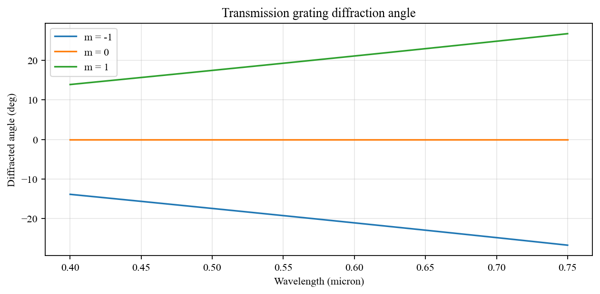
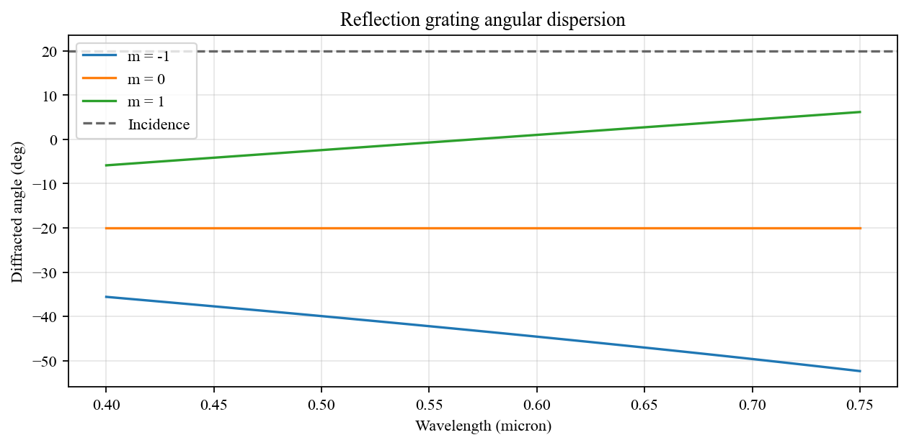
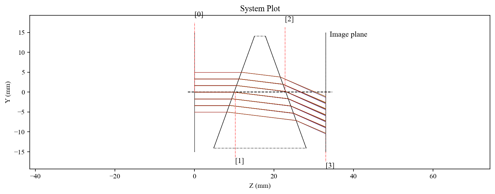
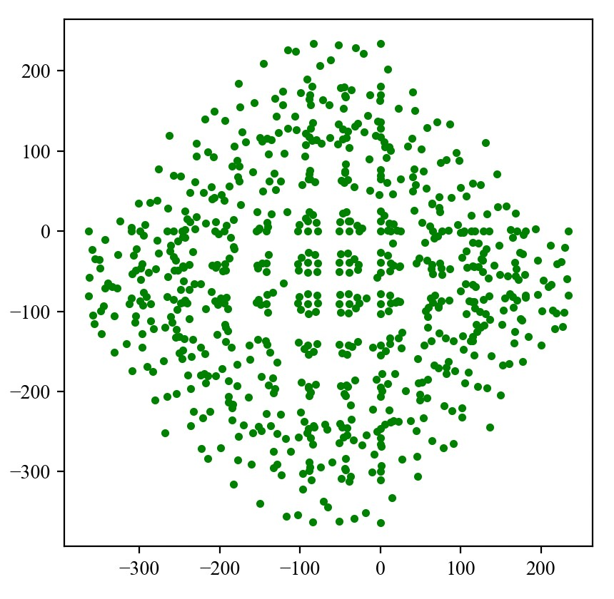
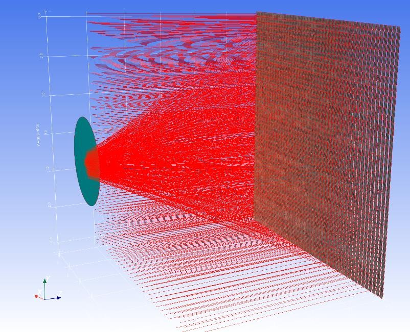
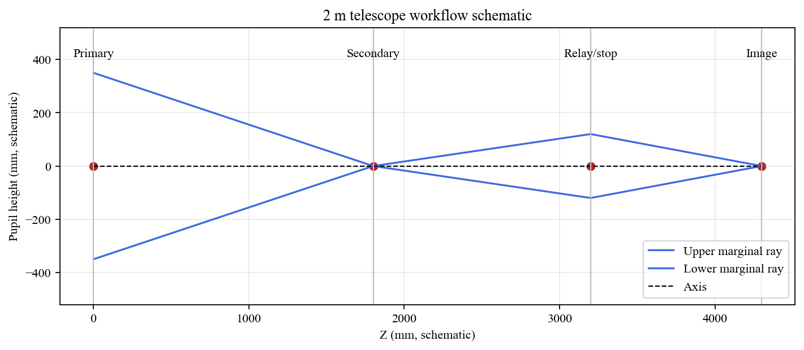
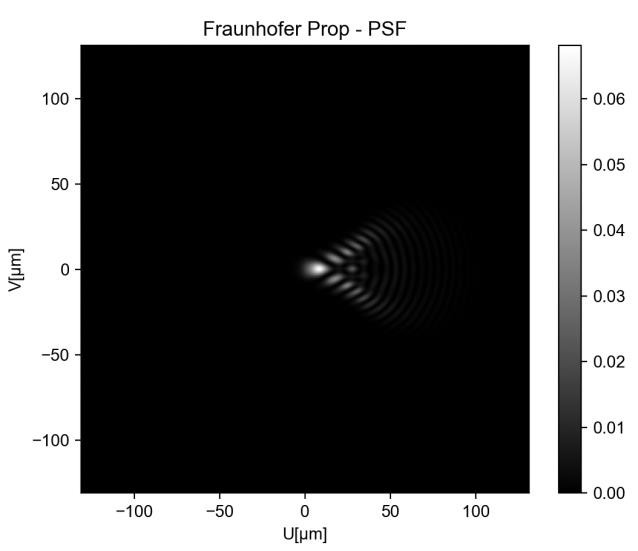
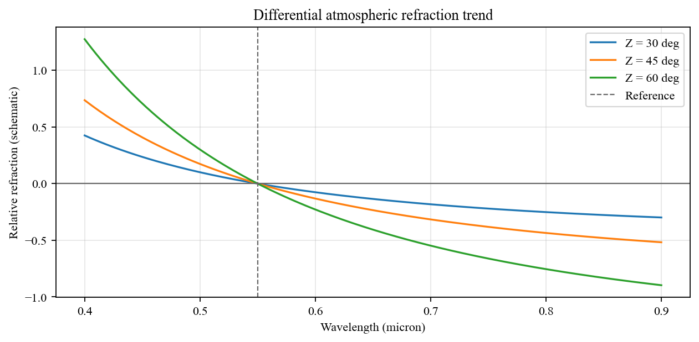
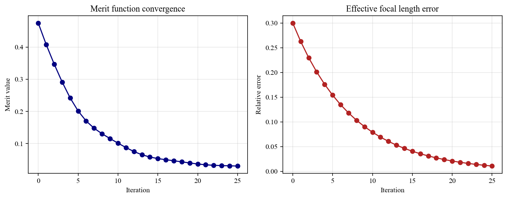

# Advanced Workflows

**Manual Navigation:** [Overview](README.md) | [Installation](installation.md) | [Core Concepts](core_concepts.md) | [First System](first_optical_system.md) | [Surfaces](surfaces.md) | [Materials](materials_and_catalogs.md) | [Ray Tracing](ray_tracing_and_ray_data.md) | [Visualization](visualization.md) | [Pupils](pupils_and_fields.md) | [Analysis](optical_analysis.md) | [Advanced](advanced_workflows.md) | [API](api_quick_reference.md)

Previous: [Optical Analysis](optical_analysis.md) | Next: [API Quick Reference](api_quick_reference.md)

---

KrakenOS includes examples that move beyond simple sequential lens systems.
These examples are powerful, but they are not ideal first-contact tutorials.
Use them after learning surfaces, ray bundles, visualization, and ray data.

## Non-Sequential Systems

Non-sequential tracing is useful for rays that may reflect, miss surfaces, or
interact with geometry in an order that is not a simple surface list.

Recommended examples:

- [`Examp_Doublet_Lens_NonSec.py`](../../KrakenOS/Examples/Examp_Doublet_Lens_NonSec.py)
- [`Examp_Doublet_Lens_NonSec-AR_Coating.py`](../../KrakenOS/Examples/Examp_Doublet_Lens_NonSec-AR_Coating.py)

## Diffraction Gratings and Spectrographs

Grating behavior is controlled through surface attributes such as diffraction
order, grating spacing, and grating angle.

Recommended examples:

- [`Examp_Diffraction_Grating_Transmission.py`](../../KrakenOS/Examples/Examp_Diffraction_Grating_Transmission.py)
- [`Examp_Diffraction_Grating_Reflection.py`](../../KrakenOS/Examples/Examp_Diffraction_Grating_Reflection.py)
- [`Examp_CzernyTurner.py`](../../KrakenOS/Examples/Examp_CzernyTurner.py)
- [`Examp_Tel_2M_Echelle.py`](../../KrakenOS/Examples/Examp_Tel_2M_Echelle.py)

## STL and Solid Geometry

STL workflows assign optical behavior to 3D geometry. These examples often need
PyVista/VTK support and may be heavier than ordinary sequential examples.

Recommended examples:

- [`Examp_Prism_STL.py`](../../KrakenOS/Examples/Examp_Prism_STL.py)
- [`Examp_Prism_STL-AR_coating.py`](../../KrakenOS/Examples/Examp_Prism_STL-AR_coating.py)
- [`Examp_Solid_Object_STL.py`](../../KrakenOS/Examples/Examp_Solid_Object_STL.py)
- [`Examp_Solid_Object_STL_ARRAY.py`](../../KrakenOS/Examples/Examp_Solid_Object_STL_ARRAY.py)

## Telescope and Instrument Models

Instrument-level examples demonstrate how the same core ideas scale to larger
systems: mirrors, stops, spiders, fields, atmospheric refraction, wavefront
analysis, and optimization.

Recommended examples:

- [`Examp_Tel_2M.py`](../../KrakenOS/Examples/Examp_Tel_2M.py)
- [`Examp_Tel_2M_Pupila.py`](../../KrakenOS/Examples/Examp_Tel_2M_Pupila.py)
- [`Examp_Tel_2M_Spyder_Spot_Diagram.py`](../../KrakenOS/Examples/Examp_Tel_2M_Spyder_Spot_Diagram.py)
- [`Examp_Tel_2M_Wavefront_Fitting.py`](../../KrakenOS/Examples/Examp_Tel_2M_Wavefront_Fitting.py)

## Optimization

KrakenOS systems can be used inside external optimization loops. The safest
workflow is to start with a small merit function, verify each term, and then
scale toward larger instrument models.

Recommended examples:

- [`Examp_Doublet_Optimization.py`](../../KrakenOS/Examples/Examp_Doublet_Optimization.py)
- [`Examp_Tel_2M_Optimization_Variables.py`](../../KrakenOS/Examples/Examp_Tel_2M_Optimization_Variables.py)
- [`Examp_Tel_2M_Wavefront_Fitting_optimization.py`](../../KrakenOS/Examples/Examp_Tel_2M_Wavefront_Fitting_optimization.py)

