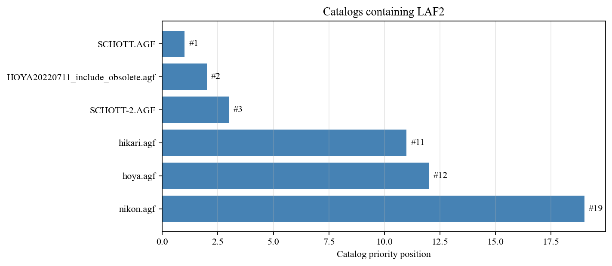
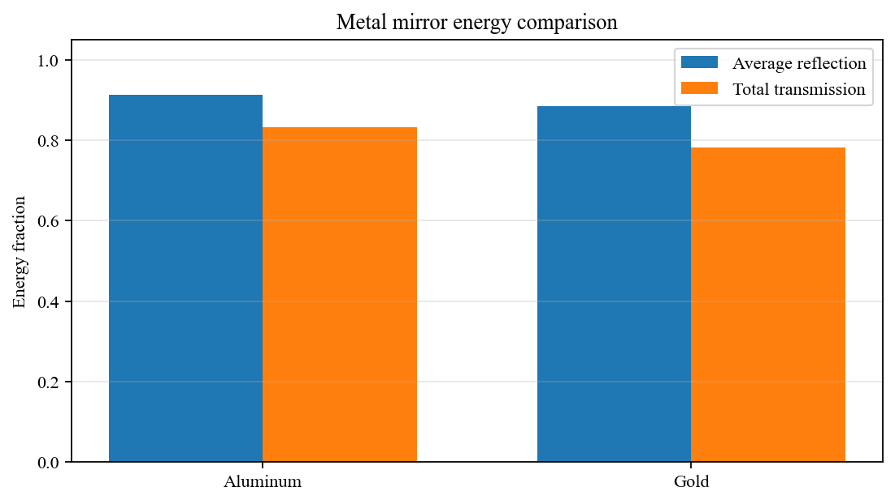

# Materials and Catalogs

**Manual Navigation:** [Overview](README.md) | [Installation](installation.md) | [Core Concepts](core_concepts.md) | [First System](first_optical_system.md) | [Surfaces](surfaces.md) | [Materials](materials_and_catalogs.md) | [Ray Tracing](ray_tracing_and_ray_data.md) | [Visualization](visualization.md) | [Pupils](pupils_and_fields.md) | [Analysis](optical_analysis.md) | [Advanced](advanced_workflows.md) | [API](api_quick_reference.md)

Previous: [Surfaces](surfaces.md) | Next: [Ray Tracing and Ray Data](ray_tracing_and_ray_data.md)

---

KrakenOS can use named glasses from AGF catalogs, numeric refractive indices,
metal data, coating data, and Zemax-style lens catalogs.

## Glass Catalogs

`Kos.Setup()` loads the default catalog configuration:

```python
config = Kos.Setup()
print(config.GlassCat[0])
```

The default order is deterministic, with `SCHOTT.AGF` first by default. This is
important because the same glass name may appear in more than one catalog. When
a glass name is duplicated, the first matching catalog in the configured order
is used.



Recommended example:

- [`Examp_Glass_Catalog_Order.py`](../../KrakenOS/Examples/Examp_Glass_Catalog_Order.py)

## Material Definitions

A surface material can be assigned in several ways:

```python
surface.Glass = "BK7"
surface.Glass = "AIR"
surface.Glass = 1.5
surface.Glass = "nvk 1.52216 58.8 0"
```

Use catalog names for ordinary optical work. Numeric indices are useful for
quick tests, but they do not represent dispersion unless the chosen string
format provides dispersion data.

Recommended example:

- [`Examp_Dispersion_By_AbbeNumber.py`](../../KrakenOS/Examples/Examp_Dispersion_By_AbbeNumber.py)

## Metal and Coating Data

KrakenOS stores reflected and transmitted energy terms after tracing. Important
fields include:

- `RP`, `RS`: reflected P and S terms
- `TP`, `TS`: transmitted P and S terms
- `TT`: total transmission term




Recommended examples:

- [`Examp_Coating_Energy_Basics.py`](../../KrakenOS/Examples/Examp_Coating_Energy_Basics.py)
- [`Examp_Metal_Mirror_Energy.py`](../../KrakenOS/Examples/Examp_Metal_Mirror_Energy.py)

## Lens Catalogs

KrakenOS can parse packaged Zemax-style lens catalogs and convert catalog
entries into `surf` lists.


Recommended examples:

- [`Examp_Lens_Catalog_Basics.py`](../../KrakenOS/Examples/Examp_Lens_Catalog_Basics.py)
- [`Examp_SurfBlock_Basics.py`](../../KrakenOS/Examples/Examp_SurfBlock_Basics.py)

Future work should add a catalog manager so users can inspect available
catalogs, duplicated glass names, and catalog priority without editing code.
