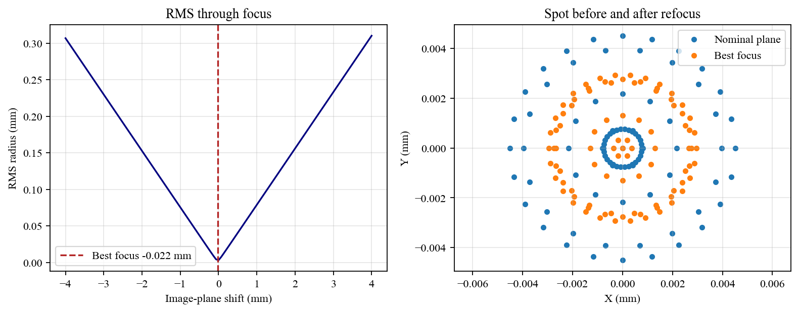
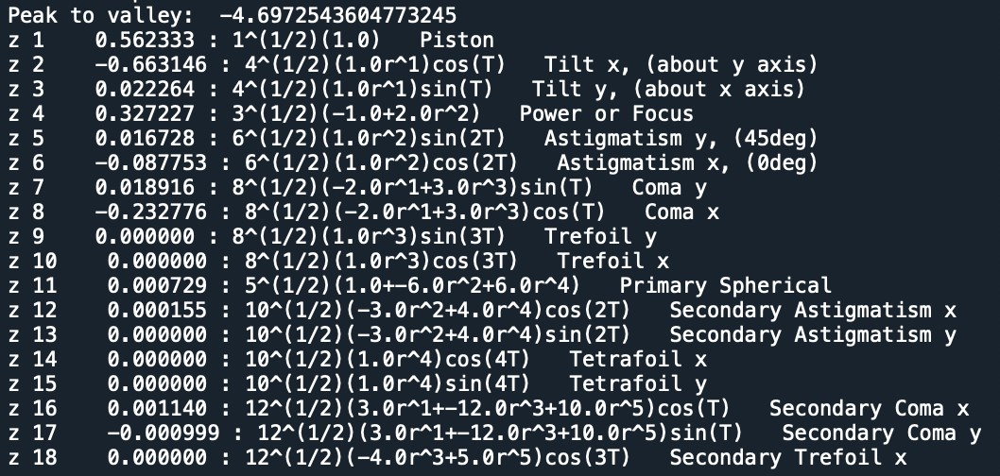

# Optical Analysis

**Manual Navigation:** [Overview](README.md) | [Installation](installation.md) | [Core Concepts](core_concepts.md) | [First System](first_optical_system.md) | [Surfaces](surfaces.md) | [Materials](materials_and_catalogs.md) | [Ray Tracing](ray_tracing_and_ray_data.md) | [Visualization](visualization.md) | [Pupils](pupils_and_fields.md) | [Analysis](optical_analysis.md) | [Advanced](advanced_workflows.md) | [API](api_quick_reference.md)

Previous: [Pupils and Fields](pupils_and_fields.md) | Next: [Advanced Workflows](advanced_workflows.md)

---

After tracing rays, KrakenOS can support geometrical, paraxial, wavefront, and
image-quality analysis.

## Paraxial Optics

Use `system.Parax(wavelength)` to calculate paraxial properties for a system:

```python
paraxial_data = system.Parax(0.55)
```

Recommended example:

- [`Examp_Doublet_Lens-ParaxMatrix.py`](../../KrakenOS/Examples/Examp_Doublet_Lens-ParaxMatrix.py)

## RMS and Best Focus

A common workflow is:

1. Trace a ray bundle.
2. Extract image-plane coordinates and direction cosines.
3. Compute RMS spot radius.
4. Shift the image plane to minimize RMS.

Recommended example:

- [`Examp_RMS_BestFocus.py`](../../KrakenOS/Examples/Examp_RMS_BestFocus.py)



## Seidel and Zernike Analysis

KrakenOS examples include Seidel calculations, Zernike-defined surfaces, and
wavefront fitting workflows. These are better approached after the user is
comfortable with tracing ray bundles and extracting data from `raykeeper`.

Recommended examples:

- [`Examp_Doublet_Lens_Pupil_Seidel.py`](../../KrakenOS/Examples/Examp_Doublet_Lens_Pupil_Seidel.py)
- [`Examp_Doublet_Lens_Zernike.py`](../../KrakenOS/Examples/Examp_Doublet_Lens_Zernike.py)
- [`Examp_Tel_2M_Wavefront_Fitting.py`](../../KrakenOS/Examples/Examp_Tel_2M_Wavefront_Fitting.py)



## PSF and MTF

The compact PSF/MTF helpers can be used directly from Zernike coefficients:

```python
psf = Kos.psf(coefficients, focal_length, diameter, wavelength, plot=0)
mtf = Kos.calculate_mtf(coefficients, focal_length, diameter, wavelength)
```

Recommended reading:

- [`psf_mtf_notes.md`](../psf_mtf_notes.md)
- [`Examp_PSF_MTF_From_Zernike.py`](../../KrakenOS/Examples/Examp_PSF_MTF_From_Zernike.py)


## Precision and Validation

For serious work, always check:

- whether rays are valid
- whether units are consistent
- whether the glass catalog source is the intended one
- whether the image plane is actually at best focus
- whether wavefront or PSF results are sampled densely enough
- whether advanced examples rely on large datasets or interactive rendering
