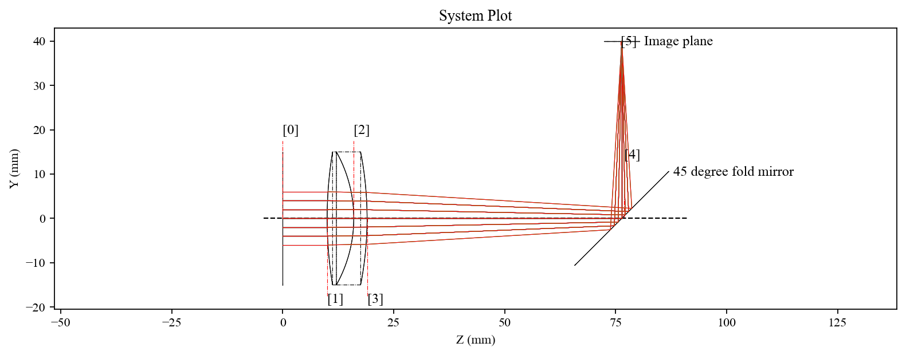
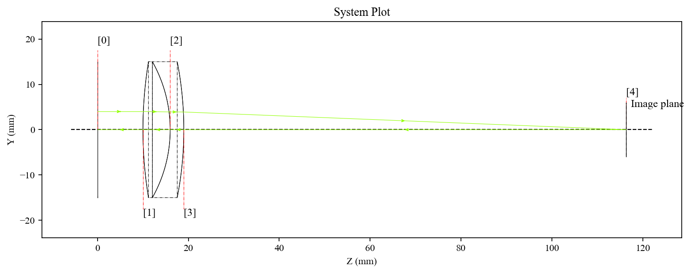

# Ray Tracing and Ray Data

**Manual Navigation:** [Overview](README.md) | [Installation](installation.md) | [Core Concepts](core_concepts.md) | [First System](first_optical_system.md) | [Surfaces](surfaces.md) | [Materials](materials_and_catalogs.md) | [Ray Tracing](ray_tracing_and_ray_data.md) | [Visualization](visualization.md) | [Pupils](pupils_and_fields.md) | [Analysis](optical_analysis.md) | [Advanced](advanced_workflows.md) | [API](api_quick_reference.md)

Previous: [Materials and Catalogs](materials_and_catalogs.md) | Next: [Visualization](visualization.md)

---

KrakenOS supports sequential, non-sequential, and reverse ray tracing.

## Sequential Tracing

Sequential tracing follows the ordered surface list:

```python
system.Trace([0.0, 4.0, 0.0], [0.0, 0.0, 1.0], 0.55)
```

Arguments are:

- ray origin `[x, y, z]`
- direction cosines `[L, M, N]`
- wavelength in micrometers

After a trace, inspect:

```python
print(system.val)
print(system.XYZ)
print(system.LMN)
print(system.GLASS)
print(system.SURFACE)
```

## Saving Many Rays

Use `raykeeper` for ray bundles:

```python
rays = Kos.raykeeper(system)

for y in [-4.0, 0.0, 4.0]:
    system.Trace([0.0, y, 0.0], [0.0, 0.0, 1.0], 0.55)
    rays.push()
```

`raykeeper` lets you extract ray data later:

```python
x, y, z, l, m, n = rays.pick(-1)
```

`pick(-1)` returns data at the last traced surface. Some workflows use
`coordinates="local"` or `coordinates="global"` depending on whether the final
data should be expressed in the surface frame or global coordinates.

## Valid and Invalid Rays

Ray bundles may contain rays that miss surfaces, are blocked, or terminate
before the image plane. Use the ray container to separate successful and
unsuccessful traces when needed.

## Non-Sequential Tracing

Non-sequential tracing is useful when ray paths are not a simple one-pass
surface order, such as reflected paths, solids, or more complex geometry:

```python
system.NsTrace(source, direction, wavelength)
```

Recommended examples:

- [`Examp_Doublet_Lens_NonSec.py`](../../KrakenOS/Examples/Examp_Doublet_Lens_NonSec.py)
- [`Examp_Prism_STL.py`](../../KrakenOS/Examples/Examp_Prism_STL.py)



## Reverse Tracing

Reverse tracing starts from image space and propagates backward:

```python
system.RvTrace(image_point, [0.0, 0.0, -1.0], 0.55, stop_surface)
```

Recommended example:

- [`Examp_Reverse_Trace.py`](../../KrakenOS/Examples/Examp_Reverse_Trace.py)


