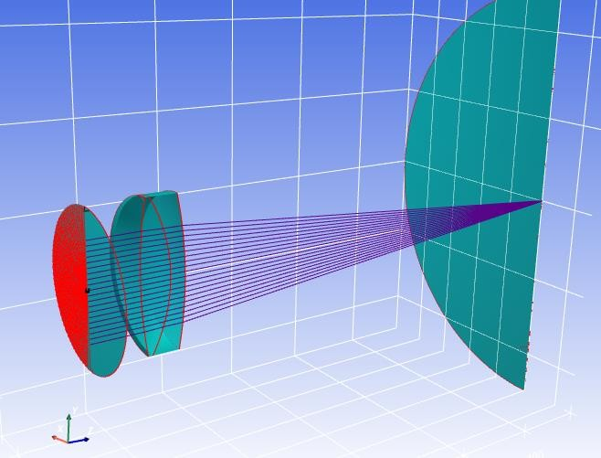

# Visualization

**Manual Navigation:** [Overview](README.md) | [Installation](installation.md) | [Core Concepts](core_concepts.md) | [First System](first_optical_system.md) | [Surfaces](surfaces.md) | [Materials](materials_and_catalogs.md) | [Ray Tracing](ray_tracing_and_ray_data.md) | [Visualization](visualization.md) | [Pupils](pupils_and_fields.md) | [Analysis](optical_analysis.md) | [Advanced](advanced_workflows.md) | [API](api_quick_reference.md)

Previous: [Ray Tracing and Ray Data](ray_tracing_and_ray_data.md) | Next: [Pupils and Fields](pupils_and_fields.md)

---

KrakenOS includes 2D and 3D visualization tools for optical systems and traced
rays. Visualization is one of the fastest ways to check whether a model is
geometrically coherent.

## 2D Layouts

```python
Kos.display2d(system, rays, view=0, arrow=1)
```

2D layouts are useful for:

- checking surface order and spacing
- verifying ray paths
- inspecting tilted or folded geometries
- producing documentation figures


The generated examples manual uses 2D figures for many beginner and
intermediate workflows.

## 3D Views

```python
Kos.display3d(system, rays, view=2)
```

3D views are useful for:

- off-axis systems
- tilted components
- STL solids
- telescope layouts
- checking whether surfaces and rays occupy the expected spatial region

Some 3D workflows require a working graphics backend. For documentation, the
image generator uses static 3D rendering where possible.




## Custom Plots

Many analyses are easier to plot directly with Matplotlib after extracting data
from `raykeeper`:

```python
x, y, z, l, m, n = rays.pick(-1)
plt.plot(x, y, "x")
plt.axis("square")
```

Recommended examples:

- [`Examp_Doublet_Lens_3Dcolor.py`](../../KrakenOS/Examples/Examp_Doublet_Lens_3Dcolor.py)
- [`Examp_Flat_Mirror_45Deg.py`](../../KrakenOS/Examples/Examp_Flat_Mirror_45Deg.py)
- [`Examp_Doublet_Lens_Pupil.py`](../../KrakenOS/Examples/Examp_Doublet_Lens_Pupil.py)
- [`Examp_PSF_MTF_From_Zernike.py`](../../KrakenOS/Examples/Examp_PSF_MTF_From_Zernike.py)
